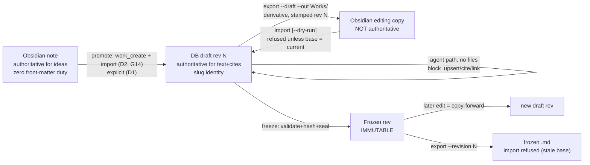

# Obsidian authoring workflow — design

**Status:** Revised 2026-09-25 after review. The review re-checked §1 against
the tree and found five of the original claims wrong or incomplete; D3, D4,
D6 and the change list were rebuilt on the corrected facts (§11 records what
changed and why). No migrations.

**Scope:** how a human's Obsidian vault (Dropbox-synced, outside this repo)
interacts with MarginaliaAI's Works system: where notes live, when a draft
becomes a "work", who is authoritative at each stage, and the exact tool
crossings. Out of scope: an Obsidian plugin, a CMS, two-way sync, persisting
LLM conversations.

**Conventions:** `RE_`-prefixed names are real settings/commands verified
against code; anything new is marked **(proposed)**. "The engine" is this
repo's core; "the agent" is any LLM driving MCP/CLI tools.

---

## 1. Ground truth the design rests on

Verified 2026-09-25 against the tree. G11–G14 were added by the review; each
one broke a decision in the first draft.

- G1. `RE_WORKS_DIR` is the only vault-adjacent setting. `Settings.works_dir:
  Path | None = None`; unset → file tools answer `works_not_configured`
  (`packages/core/src/research_engine/config/settings.py:82-84,150-162`).
  There is **no** vault/obsidian setting; `model_config` has
  `extra="ignore"`, so a new `RE_*` key is silently inert until a field is
  added.
- G2. There is exactly one real file work: `works/mishpat-tsedaqah-survey.md`
  (W-001, citations c57–c182), in this repo. `RE_WORKS_DIR` must point at the
  repo's `works/` or the file tools see nothing — the first draft pointed it
  at an empty vault folder and orphaned the survey.
- G3. The file scanner is recursive and nearly unfiltered:
  `WorkFileReader.list_works()` = `rglob("*.md")` excluding only `README.md`,
  `_TEMPLATE.md`, `_`-prefixed names
  (`services/works/files.py:31-32,149-161`). A bad header is a hard
  `WorkFileError`; a bad citation entry is soft (`entry_errors`).
  `verify_all` quarantines unreadable files per-file and continues
  (`services/works/verify.py:103-112`).
- G4. **No file→DB port exists.** The flip procedure in
  `docs/design/works-architecture-master.md §3` (F5: one transaction,
  markers-only diff) is documentation only. `_check_drift` is skipped until
  `metadata.port.file` exists, "until flip code exists"
  (`services/works/validate.py:262-285`). Consequence: file works can be
  verified/rendered/cited but **never frozen**; `work freeze` / `work_freeze`
  take a DB slug only (`services/works/publication.py:81-140`).
- G5. The DB spine (migration 012) is built and tested: `authored.*` +
  `bibliography.editions` stub; MCP tools `work_create`, `work_get`,
  `work_block_upsert`, `work_cite`, `work_link`, `work_validate`,
  `work_trace`, `work_freeze` (`mcp/dispatch.py:123-134`); CLI adds
  `work export <slug> --draft` (refuses without `--draft`,
  `cli/work.py:445-447`) and `work import <path> --slug SLUG [--dry-run]`
  (copy-forward + repoint-current in one transaction; `--dry-run` rolls back;
  `services/works/drafting.py:119-158`). Dangling `{{cite:…}}` markers refuse
  the whole import (`ImportRefused`, `drafting.py:236-250`).
- G6. No `publish` surface: `WorkPublicationService.publish()` exists
  (`publication.py:142-163`) but has no CLI command and no MCP tool.
  No MCP export/import either (CLI-only).
- G7. Two marker dialects: files use `[^cN]` (`files.py:36-44`), DB rows use
  `{{cite:<uuid>}}` with exactly one regex (`services/works/markers.py:15`).
  The rewrite is part of the unbuilt port (G4).
- G8. Authored prose cannot leak into retrieval: search reads `core`
  passages/documents/texts only; block FTS/embeddings are explicitly deferred
  (`works-architecture-diagrams.md` tool table). Ingestion takes explicit
  paths; nothing auto-ingests the vault — but nothing refuses it either.
- G9. File verify gates (`services/works/verify.py:359-372`): `none` always
  passes; `review` fails on any error; `publish` additionally fails on
  `AUTH_CITATION_EDITION_MISSING`. DB validate floor with per-type override
  via `RE_WORKS_POLICY` (`services/works/validate.py:50-69`). `AUTH_FILE_DRIFT`
  is a warning on the floor (`validate.py:66`): it never blocks freeze.
- G10. Claim refs in file front matter are inert text (`works/README.md:59-62`);
  only `work_link` types DB edges. `work_cite`/`attach` is verify-then-write:
  below `exact`/`normalized` stores nothing (`services/works/cite.py:95-109`,
  `services/works/attach.py:161-183`).
- G11. **A DB export is not a file work.** `render_markdown` writes `revision:`
  and `state:` into front matter (`drafting.py:345-353`); the file reader
  refuses unknown header keys (`files.py:110-112`). Run against a real export
  header: `WorkFileError demo.md has unknown front-matter keys: ['revision',
  'state']`. Any export under `RE_WORKS_DIR` is an `unreadable` finding.
- G12. **Import checks the slug, not the base.** `import_draft` compares only
  `front["work"]` (`drafting.py:130`) and copies forward from *current*. A
  stale export's `revision:` is ignored, so every block added since it was
  exported arrives as a deletion; the dry-run diff is the only guard.
- G13. **Export renders current only** (`drafting.py:108-113`; no `--revision`
  on the CLI). A frozen revision can be exported only until the next
  copy-forward replaces it as current.
- G14. **Import already promotes a plain note.** `parse_markdown` needs front
  matter with `work:` and nothing else: headings, paragraphs and lists become
  blocks with fresh keys; `[[wikilinks]]` and `[^1]` footnotes stay as text;
  Obsidian properties like `tags:` are ignored (tested on a sample note).
  `copy_forward` copies revision `metadata` verbatim
  (`adapters/storage/postgres/repositories/authored.py:226`), and the drift
  check compares a file against the export of the *current* revision — so a
  `metadata.port` written once would follow every later revision.

---

## 2. Decisions

### D1. Explicit promotion, never two-way sync

- Context: two writers (human in Obsidian, agent in Postgres) share content.
- Options: (a) live two-way sync; (b) explicit export/import crossings; (c) one
  side mirrors the other on a timer.
- Decision: (b). The only file→DB crossing is an explicit promote/import that
  creates a **new revision**; the only DB→file crossing is an explicit export.
- Rationale: sync needs conflict resolution the engine has no model for
  (concurrent prose edits to one block have no merge semantics; citation keys
  are UUIDs a human must never invent). G5 already implements the safe
  primitive (copy-forward + dry-run diff); sync would bypass the validation
  gates that are the system's reason to exist (G9).
- Consequence: slightly more friction per crossing; no silent overwrites
  once import refuses stale bases (G12, P0).

### D2. `work_create` (slug minting) is the moment a draft becomes a work

- Context: the design brief asked for "the explicit point" of workhood.
- Options: (a) first freeze (master doc's flip trigger); (b) `work_create`;
  (c) placing a file under `RE_WORKS_DIR`.
- Decision: (b).
- Rationale: this is master doc F4 already — "new works after 012 are
  DB-born; the file-first path survives only as import." (a) is the flip for
  *pre-012 file works* and is unimplementable today (G4). (c) confers no
  identity. `work_create` mints the slug, revision 1, and current-pointer in
  one transaction (G5) — the only identity stable across renames, exports,
  and freezes.
- Consequence: the file-first path is the survey's alone (G2). The master
  doc needs only a scope note on F1/F2: "flip at first freeze" applies to
  pre-012 file works, of which there is one.

### D3. `RE_WORKS_DIR` stays on the repo's `works/`; exports go to `<vault>/Works/`

- Context: brief options (A) works folder in the vault vs (B) separate
  authoring folder + promote.
- Options: (A) `RE_WORKS_DIR` = a vault folder holding exports; (B) the file
  contract stays in the repo, the vault holds notes and exports that no
  scanner reads.
- Decision: (B). `RE_WORKS_DIR` points at the repo's `works/` (the file-work
  contract and the survey). DB exports are written to `<vault>/Works/`, a
  plain folder the engine only ever writes to.
- Rationale: (A) fails twice. Exports are not file works (G11), so every one
  would be `unreadable` in `work verify`; and moving `RE_WORKS_DIR` off the
  repo hides the only real file work (G2). Separating the folders by format
  removes both, and makes P1's allowlist/denylist question moot.
- Consequence: `<vault>/Works/` is readable in Obsidian and safe to edit —
  an edited export is a draft to import, and a stale one is refused (P0).

### D4. Vault path parameterized, never assumed

- Context: the brief forbade assuming `~/Dropbox`.
- Decision: one explicit setting, `RE_VAULT_DIR`, the folder
  holding `.obsidian/`. No `obsidian.json` discovery.
- Rationale: the vault root here is doubly nested
  (`…/Marginalia-Writing/Marginalia-Writing/` — outer is a Dropbox folder,
  inner holds `.obsidian/`); a guess breaks on exactly this layout. The
  setting has one consumer that justifies it: the ingest guard (P3). Export
  paths are passed with `--out` and need no setting.
- Consequence: the setting's consumer is the ingest guard (P3), which
  refuses any path under the vault root. Export paths are passed with
  `--out` and need no setting.

### D5. Citations are acquired after promotion, by the agent, never hand-written

- Context: low-friction notes must not carry front matter or valid citations
  from birth (brief requirement).
- Decision: pre-promotion notes have zero engine duty. After `work_create`,
  the agent grounds prose via `work_cite`/`attach` (verify-then-write, G10)
  and pastes returned markers; the human never writes a span, UUID, or edition
  key.
- Rationale: G10 refuses unverified quotes at the write boundary — hand-made
  citations cannot enter rows even by accident. Obsidian links/footnotes remain
  plain prose to the engine (G14).
- Consequence: drafts may exist with zero citations; `validate --gate freeze`
  is the forcing function, not the note-taking surface.

### D6. Postgres authoritative post-promotion; frozen revisions immutable

- Authority table:

  | Stage | Authoritative copy | Key |
  |---|---|---|
  | Scratch / outline | Obsidian note | vault path |
  | Work (draft) | DB current revision | slug |
  | Sealed | frozen revision | content hash |
  | Reading / editing | `<vault>/Works/` export | derivative, carries its base `revision` |

- Rationale: matches what the code enforces — sealed revisions reject writes
  (`FrozenRevisionError`, `attach.py:135-139`); edits proceed by
  `copy_forward` (G14); files regenerate from rows (G5).
- The guard against a hand-edited export is on the way back in, not a drift
  check: export stamps the content hash of what it rendered, and import
  refuses a file whose stamp differs from the current revision's hash (P0).
  The revision number alone is not enough — `work_block_upsert` edits the
  current draft in place without bumping it. Drift
  stays what the master doc designed it for — ported file works — and DB-born
  works never write `metadata.port` (G14 explains why it would misfire).
- Consequence: frozen rows never change; an edited export becomes a new
  draft revision or is refused.

---

## 3. Lifecycle diagram



---

## 4. Vault layout and constitution

```text
<VAULT>/          # == RE_VAULT_DIR (proposed, D4); holds authored material ONLY
  Notes/          # fleeting notes, literature notes.
  Outlines/       # rough outlines, video-essay beats. No front-matter duty.
  Works/          # DB exports only, written by `work export --out`. No scanner reads it.
  Media/          # attachments (Obsidian attachment dir).
  Templates/      # note templates.

<REPO>/works/     # == RE_WORKS_DIR. The file-work contract + the survey (G2).
```

Constitution: never in the vault — secrets (`.env` stays at repo root,
gitignored), the Postgres data directory, ingested licensed source texts.
Ingestion must never target the vault (G8); P3 makes that a refusal rather
than a convention.

---

## 5. Workflows

### 5.1 One video essay, end to end

1. **Scratch** (`Notes/<idea>-seed.md`): plain Markdown, `[[links]]`, todos,
   half-sentences. LLM brainstorms freely; nothing touches Postgres.
2. **Outline** (`Outlines/<idea>-beats.md`): beats, B-roll notes, open
   questions ("verify Isa 5:7 span"). Still zero engine duty (D5).
3. **Promote** (D2): human says "make it a work" → `work_create` (slug,
   title, `work_type="script"`), then `work import` of the outline with
   `work: <slug>` added to its front matter (G14). Headings become beats.
   `work_link` for claim/entity refs. No citations required yet.
4. **Source**: agent searches corpus → `work_cite`/`attach` per quote (G10) →
   pastes `{{cite:<uuid>}}` via `work_block_upsert`.
5. **Verify**: `work validate <slug> --gate freeze`; iterate to green.
   Optional prose pass: `work export <slug> --draft --out Works/<slug>.md`,
   human edits (block comments and markers untouched), then
   `work import Works/<slug>.md --slug <slug> --dry-run` → review diff →
   real import.
6. **Freeze**: `work freeze <slug> --message "picture lock"
   [--waiver RULE:subject:reason]` → hash-sealed, immutable (D6). Export the
   frozen revision now if you want a reading copy (G13, until P0 adds
   `--revision`): `work export <slug> --draft --out Works/<slug>.r<N>.md`.
7. **Later edit**: export → edit → import as rev N+1. The frozen rev and
   its reading copy are untouched; importing the reading copy is refused
   once P0 lands (stale base).

### 5.2 Standing rules

- Human in Obsidian: brainstorm, outline, prose-edit exports in `Works/`.
  Never hand-type a block comment, marker, or citation key.
- Agent via tools: search/verify/cite/link/validate/freeze over MCP; file
  tools (`work_verify`, `work_cite_entry`, `work_render`) only for the
  survey (G2). LLM history is never persisted — only resulting
  blocks/cites/links.
- Crossings, all explicit (D1): promote, export, import→new revision, freeze.

---

## 6. Command reference (exact, verified)

Files (need `RE_WORKS_DIR`): `work verify [PATH] [--gate review|publish]
[--json]` · `work citations` (exactly one selector; see `--help`) ·
`work render <path> [--out]` · `work cite-entry …` (paste-ready YAML, G10).
DB: `work show <slug> [--revision]` · `work validate <slug> [--revision]
[--gate none|freeze|publish]` · `work freeze <slug> [--message]
[--waiver RULE:subject:reason]` · `work export <slug> --draft [--out FILE]`
(current revision only, G13) · `work import <path> --slug SLUG [--dry-run]`.
MCP mirrors both halves except export/import/publish (G6). Gate exit codes:
`verify` 1 = gate failure, 2 = bad gate/usage.

---

## 7. Failure cases and recovery

| Failure | Detection | Recovery |
|---|---|---|
| Dropbox conflict copy in `Works/` | visible in Obsidian; import of either names the same slug | import the one you want; after P0 the second is refused as stale |
| Accidental deletion (vault note) | Dropbox rewind | restore; DB works unaffected (D6) |
| Accidental deletion (`Works/` export) | `work_get`/`show` unaffected | regenerate with `export --draft --out` (derivative) |
| Human + agent concurrent edit | today: dry-run diff shows the agent's blocks as deletions (G12); after P0: import refused | re-export, re-apply the human's hunk, import |
| Malformed front matter | import `ValueError` | fix fences/keys, re-run |
| Broken marker | import refused `AUTH_CITATION_MARKER_DANGLING`, nothing written (G5) | re-paste marker from `work_get`; never hand-type UUIDs |
| Stale source span | `AUTH_SOURCE_SPAN_STALE` error blocks freeze (G9) | `work_cite_entry` re-resolves, agent re-attaches; or waiver with actor+reason |
| Edit to frozen reading copy | after P0: import refused (stale base) | discard, or re-export current and re-apply |
| Partial sync | non-case on Linux (full-file sync) | retry, don't "fix" the file |

---

## 8. What works today

No code needed: §4 layout; `RE_WORKS_DIR` on the repo's `works/`; promote by
`work_create` + CLI `work import` (G14); the export/import loop, with the
dry-run diff as the only stale-base guard until P0; freeze; file
verify/render for the survey.

---

## 9. Minimal change list (priority order, no migrations)

- **P0 — Safe crossings.** Export stamps `base:` (the `hash_assembled` of
  the rendered revision); import refuses when it differs from the current
  revision's hash (`AUTH_PARENT_REVISION_MISMATCH` exists as a rule id);
  `work export --revision N`; `work_export` / `work_import` MCP
  tools over `WorkExportService`; `work promote` as a thin CLI/MCP wrapper
  that runs `work_create` + import in one transaction, so a failed import
  leaves no empty work. Tests: stale-base refusal; frozen export by revision;
  plain-note promote round-trip; slug-mismatch refusal.
- **P1 — Conflict copies in the file scanner.** `list_works` skips
  `*conflicted copy*` and `*.sync-conflict-*`. Small, since D3 keeps the
  vault out of `RE_WORKS_DIR`.
- **P2 — Publish.** `work publish` CLI + `work_publish` MCP over
  `publish()` (G6). Tests: edition-missing graduates to error at publish;
  CLI/MCP parity.
- **P3 — Vault guard + master-doc note.** `RE_VAULT_DIR` Settings field
  (implemented); `ingest_paths` refuses any path under it. Master doc F1/F2
  get a scope note: the flip applies to pre-012 file works.
- **Deferred:** the survey's port (F5) — still unbuilt, so it stays a file
  work under `works/`.

---

## 10. First milestone (no plugin, no CMS)

1. Folders per §4; `RE_WORKS_DIR` on the repo's `works/`; `<vault>/Works/`
   created.
2. One real outline through §5.1 steps 3–6, promoted by `work_create` +
   `work import`.
3. Acceptance: frozen rev with hash; its export readable in Obsidian;
   `work verify` still reports the survey with zero `unreadable`; vault holds
   no secrets or licensed text.

---

## 11. Review resolutions

1. **Does D2 contradict a freeze/publish invariant?** No. Master F4 already
   makes new works DB-born; F1/F2 only need scoping to pre-012 file works.
2. **`metadata.port` in JSONB or a column?** Neither for DB-born works. It
   is copied forward and compared against current (G14), so it would misfire
   on every later revision. The export guard is the stale-base refusal on
   import (P0). `work_revisions.metadata` is JSONB in 012 (line 103) if the
   survey's port ever needs it.
3. **Scanner allowlist or denylist?** Moot: the discriminator is format
   (G11), and D3 keeps exports out of `RE_WORKS_DIR`. P1 only skips conflict
   copies.
4. **A guard against ingesting the vault?** Yes, in code: `ingest_paths`
   refuses paths under `RE_VAULT_DIR` (P3). That is the setting's reason to
   exist.
5. **Frozen exports in Dropbox?** Fine once import refuses stale bases: an
   edited reading copy can't silently revert anything. Split folders by role
   (file contract in the repo, exports in the vault), not by frozen vs draft.
