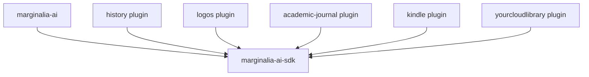
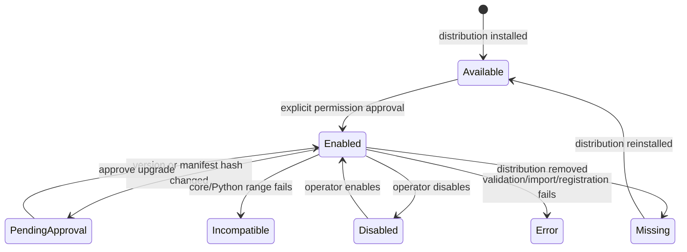

# PyPI distribution and plugin architecture

**Status:** Proposed architecture  
**Scope:** `marginalia-ai`, `marginalia-ai-sdk`, the in-tree history pack, and the
Logos, academic-journal, Kindle, and YourCloudLibrary repositories  
**Related review:** [PyPI readiness review](../pypi-readiness.md)
**Implementation runbooks:** [PyPI/plugin migration execution index](../implementation/pypi-plugin-migration/index.md)

## 1. Decision

Adopt standard Python distributions and package-metadata entry points for every plugin.

- Publish core as `marginalia-ai`.
- Publish the standalone contract as `marginalia-ai-sdk`.
- Publish each plugin as an independent `marginalia-ai-plugin-*` distribution.
- Discover installed plugins through the `research_engine.plugins` entry-point group.
- Keep runtime manifests as static package resources that core can inspect **without importing
  plugin code**.
- Let pip, uv, or pipx install and remove distributions. Core must not mutate its own Python
  environment, clone repositories, or execute manifest setup commands.
- Require an explicit core-side approval step before an installed plugin is enabled and
  imported.
- Move heavyweight core features behind extras so base installation contains no Torch,
  Docling, CUDA, or local model runtime.

This replaces the current Git-copy loader. It is a clean cutover, not a second installation
path maintained beside the first.

## 2. Why this architecture

The current system mixes four independent concerns:

1. acquiring plugin source with Git;
2. resolving Python dependencies by mutating the running environment;
3. approving permissions;
4. discovering and loading contributions.

That coupling creates the present failures:

- `pip install` cannot make a plugin visible to core;
- plugin install may run `shell=True` setup commands without the documented approval screen;
- a globally available `uv` may modify an environment other than the interpreter running core;
- code is copied into `~/.research-engine/plugins`, outside normal package ownership;
- manifests duplicate dependency declarations already expressible in `pyproject.toml`;
- plugins import core internals because the standalone SDK is empty without core;
- the loader can partially modify the registry before a later contribution fails;
- external plugin releases cannot use standard PyPI metadata, resolver behavior, attestations,
  or uninstall semantics.

Python entry points solve acquisition/discovery without inventing another package manager.
They are the standard mechanism for an installed distribution to advertise a plugin to a host
application.

## 3. Goals and non-goals

### 3.1 Goals

- A lightweight `pip install marginalia-ai` with no Torch/CUDA/Docling dependency.
- Independently versioned core, SDK, and plugin artifacts.
- Standard pip/uv/pipx install, upgrade, and uninstall behavior.
- Static permission review before any plugin module is imported.
- One stable SDK dependency direction: plugin → SDK ← core.
- No plugin dependency installation or shell execution inside the running application.
- Deterministic discovery, compatibility checks, collision handling, and failure reporting.
- Atomic plugin registration: all contributions become visible or none do.
- Existing corpus/plugin data survives the cutover.
- Release artifacts are buildable, testable, attestable, and installable without repository
  checkouts.

### 3.2 Non-goals

- This does not make in-process Python plugins a security sandbox.
- This does not install PostgreSQL, browsers, Tesseract, CUDA drivers, models, or service
  credentials.
- This does not bundle service-specific plugins with core.
- This does not make licensed Kindle, Logos, or library content redistributable.
- This does not preserve the Git-copy loader as a compatibility path.
- This does not require every plugin to release on the core schedule.

## 4. Distribution topology

| Repository/component | Distribution | Import package | Entry point | Release cadence |
|---|---|---|---|---|
| Core | `marginalia-ai` | `research_engine` | console script `research-engine` | Core/SDK lockstep through `0.x` |
| SDK | `marginalia-ai-sdk` | `research_engine_sdk` | none | Core/SDK lockstep through `0.x` |
| In-tree history pack | `marginalia-ai-plugin-history` | `history` | `history = "history"` | Independent plugin version |
| Logos repo | `marginalia-ai-plugin-logos` | `logos` | `logos = "logos"` | Independent |
| Academic journal repo | `marginalia-ai-plugin-academic-journal` | `acad` | `academic-journal = "acad"` | Independent |
| Kindle repo | `marginalia-ai-plugin-kindle` | `kindle` | `kindle = "kindle"` | Independent |
| YourCloudLibrary repo | `marginalia-ai-plugin-yourcloudlibrary` | `ycl` | `yourcloudlibrary = "ycl"` | Independent |

The existing GitHub repository names may remain `marginalia-plugin-*`; repository and PyPI
distribution names need not match. The public distribution family should match the core
package users install.

All five proposed plugin distribution names returned 404 from PyPI during this design review.
That is not a reservation. Configure pending Trusted Publishers only when artifacts are ready,
then publish promptly.

## 5. Dependency architecture

### 5.1 Base core

Base `marginalia-ai` owns the CLI, configuration, PostgreSQL adapters and migrations, MCP,
remote inference clients, citation/works services, and lightweight text processing.

Recommended base dependencies:

```toml
[project]
dependencies = [
    "marginalia-ai-sdk>=0.6,<0.7",
    "pydantic>=2.5,<3",
    "pydantic-settings>=2.1,<3",
    "sqlalchemy[asyncio]>=2.0,<3",
    "asyncpg>=0.29,<1",
    "pgvector>=0.3,<1",
    "alembic>=1.13,<2",
    "anthropic>=0.40,<1",
    "httpx>=0.27,<1",
    "typer>=0.12,<1",
    "rich>=13,<14",
    "jinja2>=3.1,<4",
    "mcp>=1.0,<2",
    "pyyaml>=6,<7",
    "structlog>=24.1,<25",
    "uuid-utils>=0.9,<1",
    "packaging>=23",
]
```

Anthropic stays in base because it is the current default LLM provider. It may become an extra
later if provider selection is made mandatory. OpenAI is not the default and should be
optional.

`tiktoken` is removed. No core or test code imports it; token estimates are implemented by
`services/text/tokens.py`.

### 5.2 Core extras

```toml
[project.optional-dependencies]
openai = [
    "openai>=1.10,<2",
]
local-inference = [
    "sentence-transformers>=3.0,<4",
]
documents = [
    "pymupdf>=1.24,<2",
    "ebooklib>=0.18,<1",
    "beautifulsoup4>=4.12,<5",
    "lxml>=5.1,<6",
]
document-ai = [
    "docling>=2.70,<3",
]
embed-server = [
    "fastapi>=0.110",
    "uvicorn>=0.27",
    "sentence-transformers>=3.0,<4",
]
full = [
    "openai>=1.10,<2",
    "sentence-transformers>=3.0,<4",
    "pymupdf>=1.24,<2",
    "ebooklib>=0.18,<1",
    "beautifulsoup4>=4.12,<5",
    "lxml>=5.1,<6",
    "docling>=2.70,<3",
    "fastapi>=0.110",
    "uvicorn>=0.27",
]
```

The distinction between `documents` and `document-ai` is deliberate:

- PyMuPDF, ebooklib, BeautifulSoup, and lxml handle normal PDF text, EPUB, HTML, and TEI
  without Torch.
- Docling handles layout, scans, office formats, images, and OCR, and pulls Torch even when
  configured to run on CPU.
- CUDA is required only for selected GPU execution. It is not a core, remote inference, basic
  document, or CPU Docling requirement.

A CPU installation follows PyTorch's CPU-wheel instructions before installing extras. Standard
PyPI dependency metadata cannot select PyTorch's alternate CPU wheel index.

### 5.3 Required lazy-import changes

Moving dependencies is not enough. Core must enforce the optional boundary:

- `build_inference()` imports local embedding/reranking adapters only inside local branches.
- `remote_api` mode never imports sentence-transformers.
- `auto` mode either requires `local-inference` for fallback or reports that fallback is
  unavailable; it never crashes from an incidental import.
- Register `DoclingModule` only when Docling is installed. Without it, PDFs fall back to
  `PDFTextModule`; HTML and Markdown use their lightweight modules.
- Missing support for DOCX/PPTX/XLSX/images produces an actionable
  `marginalia-ai[document-ai]` message.
- Provider-specific LLM adapters import only when selected.

A base-artifact CI job must assert that `torch`, `sentence_transformers`, and `docling` are not
installed while CLI help, config, migration, and remote-adapter smoke tests pass.

## 6. SDK boundary

### 6.1 Dependency direction



`marginalia-ai-sdk` must never import `research_engine`. Core implementations conform to SDK
protocols; plugins consume only SDK contracts.

### 6.2 Proposed SDK layout

```text
research_engine_sdk/
  __init__.py
  py.typed
  manifest.py       # PluginManifest v2 and contribution models
  types.py          # DTOs passed across the boundary
  clients.py        # scoped service Protocols
  decorators.py     # @tool and @hook metadata
  errors.py         # public, transport-safe errors
  chunking.py       # stable chunking DTOs/helpers needed by custom chunkers
  testing.py        # mocks and contract checks
```

### 6.3 Public SDK contents

The SDK owns:

- `PluginManifest` and contribution schemas;
- `Document`, `Passage`, `PassageDraft`, `NodeDraft`, `ParsedDocument`, `SourceRef`,
  `DetectionResult`, event/query DTOs exposed to plugins;
- `CorpusClient`, `IngestionClient`, `EntityClient`, `EventClient`, `EdgeClient`,
  `ExtractionClient`, `LLMClient`, and `HttpClient` protocols;
- `IngestionModule`, `Chunker`, `PostIngestionHook`, and `SourceSearchProvider` protocols;
- decorators and public errors;
- stable chunking helpers needed to implement custom chunkers;
- isolated unit-test mocks and the chunker contract.

The SDK does not expose repositories, SQLAlchemy tables, the composition root, PostgreSQL
engines, or core service classes.

### 6.4 Eliminate current core leaks

| Current leak | Replacement |
|---|---|
| Kindle/YCL import `ProseWindowChunker` | `IngestionClient.ingest_document()` accepts full text and core applies the document type's configured chunker. |
| Logos imports `PassageDraft`, token helpers, and chunk cap helpers | Move the intentionally stable DTO/helper subset to `research_engine_sdk.chunking`. |
| Logos imports `build_node_tree` | Accept SDK `NodeDraft`/section DTOs through `IngestionClient`; core validates and builds storage nodes. |
| Logos imports `EmbeddingUnavailable` | Export the public operational error from SDK. |
| History imports `EventFilter` | Make `EventFilter` an SDK DTO or have `EventClient.query()` accept a validated SDK filter/dict. |
| Plugin tests import `research_engine.testing` | Move portable contracts to `research_engine_sdk.testing`; database integration fixtures may depend on `marginalia-ai[dev]`. |
| Plugins import `research_engine.plugins.sdk` | Clean cutover to `research_engine_sdk`. |

## 7. Plugin distribution contract

### 7.1 Entry-point group

Every plugin wheel declares exactly one entry point in the core-owned group:

```toml
[project.entry-points."research_engine.plugins"]
kindle = "kindle"
```

The value is the plugin's unique top-level import package. It is a discovery marker; core does
not call `EntryPoint.load()` during discovery.

Constraints:

- one plugin entry point per distribution;
- entry-point name equals the runtime plugin id;
- value is one top-level module name, with no attribute or extras;
- distribution name starts with `marginalia-ai-plugin-` for official packages;
- top-level package may not shadow stdlib or another installed plugin package;
- duplicate plugin ids are an error; core loads neither claimant.

### 7.2 Static manifest location

The manifest moves inside the import package:

```text
kindle/
  __init__.py
  plugin.yaml
  tools/
  ...
```

Core finds it using `EntryPoint.dist.files` and `Distribution.locate_file()`. Reading the file
does not import `kindle` or execute plugin code.

Do not keep a second root `pack.yaml`. One manifest is authoritative.

### 7.3 Manifest v2

Distribution metadata owns version, author, summary, license, requirements, URLs, and Python
dependencies. The runtime manifest owns only the runtime contract:

```yaml
schema_version: 2
plugin_id: kindle

requires:
  core_api: ">=0.6,<0.7"
  python: ">=3.11"

permissions:
  network: egress
  network_allowlist:
    - read.amazon.com
    - amazon.com
  filesystem: plugin_data
  subprocess: true
  ingest: true

provides:
  document_types:
    - id: kindle_book
      default_chunker: prose_window
  mcp_tools:
    - id: kindle.ingest_book
      entry: kindle.tools.ingest_book:handler
      description: Scrape or reuse cached text and ingest a Kindle book.
      input_schema:
        type: object
        properties:
          book_asin: {type: string}
        required: [book_asin]
```

Removed from the manifest:

- `version`, `author`, `description`, `license`, and `homepage`;
- `requires.pip`;
- `requires.setup_commands`.

Core reads identity metadata from the installed distribution and rejects a plugin if:

- the entry-point name and `plugin_id` differ;
- the distribution version is not valid PEP 440;
- Python or core compatibility is unsatisfied;
- a declared resource is absent from the wheel;
- an entry module is outside the advertised top-level package;
- tool ids are not namespaced by plugin id, except explicitly shared core vocabularies.

### 7.4 Package data

Every schema, vocabulary, and manifest referenced at runtime must be under the import package
and present in both wheel and sdist. Release CI inspects the artifacts directly.

Example:

```text
acad/
  plugin.yaml
  schemas/
    extraction_schemas/
      bibliography_references.yaml
```

## 8. Discovery, approval, and loading

### 8.1 State machine



No newly discovered plugin auto-enables.

### 8.2 Discovery algorithm

For each `research_engine.plugins` entry point:

1. Read entry-point and distribution metadata without importing code.
2. Validate the entry-point name/value and distribution-name convention.
3. Locate `<top_package>/plugin.yaml` in that distribution's installed files.
4. Parse with `research_engine_sdk.manifest.PluginManifest`.
5. Validate resource paths and compatibility.
6. Hash the manifest bytes with SHA-256.
7. Reconcile the discovered `(distribution, version, manifest hash)` with persisted approval.
8. Report `available`, `enabled`, `pending approval`, `missing`, `incompatible`, or `error`.

Discovery must be callable without a running MCP server:

```bash
research-engine plugin list
research-engine plugin audit kindle
research-engine plugin doctor
```

### 8.3 Approval flow

```bash
python -m pip install marginalia-ai-plugin-kindle
research-engine plugin enable kindle
```

`enable` displays, before import:

- distribution and plugin identity/version;
- publisher/project URLs;
- every contribution;
- every permission and network allowlist;
- whether plugin-specific database migrations are declared;
- manifest hash;
- version/core/SDK compatibility.

The command requires explicit confirmation in an interactive terminal. Non-interactive use
requires `--yes` and records that mode. Approval stores the exact version, manifest hash, and
permissions. A changed version or hash becomes `pending approval`; it is not loaded until
approved.

### 8.4 Loading algorithm

Only an enabled, exactly approved distribution may load:

1. Revalidate version/hash/compatibility.
2. Build a temporary `PluginRegistryStage`.
3. Import and validate every declared entry into that stage.
4. Validate schemas, tool input schemas, ids, dependencies, and collisions.
5. Build permission-scoped clients.
6. Commit the complete stage to the live registry atomically.
7. On any failure, discard the stage and report one plugin load error.

This prevents the current behavior where early types can remain registered after a later tool
fails.

### 8.5 Upgrades and removals

```bash
python -m pip install --upgrade marginalia-ai-plugin-kindle
research-engine plugin approve-upgrade kindle
```

Core never runs pip. An external upgrade changes distribution metadata; core notices and
requires approval before the next load.

```bash
research-engine plugin disable kindle
python -m pip uninstall marginalia-ai-plugin-kindle
```

Removing a distribution leaves corpus data and the approval audit row. `plugin list` reports
it as missing. Reinstallation does not auto-enable a different artifact.

For pipx:

```bash
pipx inject marginalia-ai marginalia-ai-plugin-kindle
pipx runpip marginalia-ai uninstall marginalia-ai-plugin-kindle
```

### 8.6 Development installs

Editable installs replace `--link`:

```bash
python -m pip install -e ../marginalia-plugin-logos
research-engine plugin enable logos
```

`direct_url.json` supplies source/editable provenance. Core treats code or manifest changes as
pending approval when the manifest hash changes. Source-code-only edits retain approval but
require server restart; development mode is explicitly trusted code.

## 9. Persistence model

Rename `core.installed_packs` to `core.plugin_activations`; it records approval and runtime
state, not ownership of installed files.

Proposed columns:

| Column | Purpose |
|---|---|
| `plugin_id` | Stable manifest/entry-point id; primary key. |
| `distribution_name` | Normalized installed distribution name. |
| `distribution_version` | Approved version. |
| `entry_point_name` | Discovery identity. |
| `manifest_sha256` | Exact approved runtime contract. |
| `manifest` | Approved manifest snapshot for audit. |
| `permissions_granted` | Exact approved permission set. |
| `enabled` | Operator intent. |
| `state` | `available`, `enabled`, `disabled`, `pending_approval`, `missing`, `incompatible`, `error`, or `legacy`. |
| `approved_at` | Permission approval time. |
| `approved_non_interactive` | Whether `--yes` supplied approval. |
| `last_seen_at` | Last discovery reconciliation. |
| `last_error` | Current validation/load error, not historical log. |
| `provenance` | Installed distribution `direct_url.json`, index/source URL where available. |

`source_url` and `source_ref` stop being required columns. PyPI versions, artifact hashes,
attestations, and `direct_url.json` replace the Git checkout as package provenance.

## 10. Plugin data and database migrations

### 10.1 Data directories

Installed code belongs in site-packages. Mutable state belongs under core's configured data
directory:

```text
~/.research-engine/
  plugin-data/
    logos/
    academic-journal/
    kindle/
    yourcloudlibrary/
    history/
```

Core passes a resolved `PluginContext.data_dir` to plugin lifecycle/tool code. Plugins stop
hard-coding `~/.marginalia/plugins` or deriving paths from their source tree.

Credentials, browser profiles, cookies, extracted licensed text, and checkpoints are never
included in wheels or source distributions.

### 10.2 Plugin-owned tables

Logos and academic-journal own tables outside core's migration chain. Make that lifecycle
explicit rather than running DDL lazily from arbitrary tool calls.

Manifest shape:

```yaml
provides:
  database:
    current_revision: 3
    upgrade_entry: logos.db.migrate:upgrade
    status_entry: logos.db.migrate:status
```

After permission approval:

```bash
research-engine plugin migrate logos
```

Rules:

- core never imports/runs the migration entry before approval;
- migration is explicit, transactional where PostgreSQL permits, and records the plugin
  revision;
- plugin load refuses with `migration required` when its declared revision is ahead;
- core schema migrations never edit plugin-owned tables;
- plugin uninstall never drops user data automatically;
- destructive cleanup requires a separate explicit plugin command.

## 11. Security model

### 11.1 What improves

- pip/uv resolves dependencies before runtime instead of the service mutating itself;
- wheels have immutable versions, hashes, metadata, attestations, and normal uninstall
  records;
- discovery reads a static manifest without importing plugin code;
- permission changes require approval;
- no manifest shell commands;
- no arbitrary Git branch is cloned by the running service;
- loader registration is atomic;
- installed distribution provenance is auditable.

### 11.2 What does not improve

An enabled plugin is trusted in-process Python code. It can import the standard library and
reach process-global state. Scoped clients enforce the supported API contract; they are not a
sandbox against malicious code.

Public documentation must say this directly. A future subprocess/IPC plugin host can enforce a
stronger boundary without changing plugin business APIs if SDK clients remain protocol-based.

### 11.3 External setup

Wheel installation must not run browser or OS setup. Each affected plugin provides explicit
console commands:

- Logos: `logos-login`, `logos-diagnose`;
- Kindle: `research-engine-kindle-setup` and/or first-run visible browser login;
- YourCloudLibrary: `research-engine-ycl-login`;
- Docling/local inference: documented model downloads;
- pytesseract: documented system `tesseract` binary.

Playwright browser installation is an explicit operator command, never a manifest
`setup_command`.

## 12. CLI contract

Replace the current install/uninstall semantics:

```text
research-engine plugin list
research-engine plugin audit <id>
research-engine plugin enable <id>
research-engine plugin approve-upgrade <id>
research-engine plugin disable <id>
research-engine plugin migrate <id>
research-engine plugin doctor [<id>]
research-engine plugin forget <id>      # remove approval row only; never pip uninstall
```

Remove:

```text
research-engine plugin install <git-or-path>
research-engine plugin uninstall <id>
research-engine plugin install --link
```

When asked to install an unavailable plugin, CLI prints the environment-appropriate command
rather than executing it:

```text
Plugin 'kindle' is not installed in this Python environment.
Install it with:
  python -m pip install marginalia-ai-plugin-kindle
For pipx:
  pipx inject marginalia-ai marginalia-ai-plugin-kindle
```

## 13. Per-repository changes

### 13.1 MarginaliaAI / core repository

#### `packages/sdk`

- Move real SDK contracts out of `research_engine.plugins.sdk`.
- Remove the conditional re-export/empty-package behavior.
- Add manifest v2 models and validation.
- Add SDK chunking types/helpers and testing contracts.
- Add `py.typed` only after type-checking the public surface.
- Add package README, Apache license file, complete metadata, URLs, and Trusted Publishing.
- Add standalone wheel/sdist tests with core absent.

#### `packages/core`

- Depend on `marginalia-ai-sdk`; delete the duplicate core SDK package.
- Add entry-point discovery with no-import manifest inspection.
- Replace `PluginInstaller` with discovery/approval services.
- Remove Git clone, runtime pip installation, and shell setup execution.
- Refactor `PluginLoader` around distribution metadata and atomic registry staging.
- Add the `plugin_activations` database migration/repository/domain model.
- Add the new plugin CLI contract.
- Pass plugin data paths through an SDK context/client rather than source-directory paths.
- Add explicit plugin migration lifecycle.
- Split core optional dependencies and remove `tiktoken`.
- Fix local inference and Docling lazy/conditional imports.
- Add installed-artifact database migration command and public setup docs.
- Add release workflow and artifact smoke matrix.

#### `packages/plugins/history`

Turn the in-tree pack into a real workspace distribution:

```text
packages/plugins/history/
  pyproject.toml
  src/history/                 # or retain history/ with explicit Hatch mapping
    plugin.yaml
    ...
```

- Distribution: `marginalia-ai-plugin-history`.
- Depend on `marginalia-ai-sdk`, not core.
- Replace the `research_engine.domain.events.EventFilter` import with the SDK query contract.
- Ensure every tool has a valid input schema; the currently installed older pack fails this
  check for `history.find_missing_letters`.
- Add entry point, README, Apache license, metadata, and artifact tests.
- Release independently after core/SDK `0.6`.

### 13.2 Logos repository

Current state:

- Has a Hatch project named `marginalia-plugin-logos` at `0.1.0`.
- Has no Git tags.
- Imports many core internals: SDK under core, passage/node DTOs, chunking helpers, token
  helpers, and core errors.
- Declares MIT in `pyproject.toml`/manifest while the GitHub repository reports an
  Apache-2.0 license.
- Uses sibling checkout/PYTHONPATH assumptions in CI and operational docs.

Required changes:

- Rename distribution to `marginalia-ai-plugin-logos` before first PyPI upload.
- Choose one license; recommended: align metadata/manifest history with the existing
  Apache-2.0 repository license.
- Depend on `marginalia-ai-sdk>=0.6,<0.7`.
- Move runtime manifest to `logos/plugin.yaml`; add entry point `logos = "logos"`.
- Replace every `research_engine.*` import with SDK contracts or plugin-owned code.
- Use SDK chunker helpers/DTOs for `VerseChunker`.
- Send full text, sections, and node drafts through `IngestionClient` rather than importing
  core orchestration/domain implementations.
- Package extraction schemas and migration resources.
- Declare plugin database migration lifecycle.
- Keep Playwright authentication in an `auth` extra and retain explicit `logos-login`.
- Test against installed SDK/core wheels, not a sibling checkout.
- Add README/license/URLs/classifiers, `twine check --strict`, clean-wheel smoke, tags, and
  Trusted Publishing.

### 13.3 Kindle repository

Current state:

- Hatch distribution `marginalia-plugin-kindle` `0.3.1`; tags through `v0.3.1`.
- Consistent Apache-2.0 repository/package license.
- Imports the SDK through core and imports core `ProseWindowChunker` directly.
- Requires EasyOCR by default, which pulls Torch/CUDA.
- Uses manifest setup commands to install Chromium.

Required changes:

- Rename distribution to `marginalia-ai-plugin-kindle`.
- Depend on `marginalia-ai-sdk>=0.6,<0.7`.
- Move manifest to `kindle/plugin.yaml`; add entry point `kindle = "kindle"`.
- Let `IngestionClient` apply `prose_window`; remove the core chunker import.
- Keep Playwright/Pillow/pytesseract as normal dependencies.
- Move EasyOCR to optional extra `gpu-ocr`; lazy-import it only when selected.
- Document the external Tesseract executable separately.
- Replace automatic `playwright install chromium` with an explicit setup command.
- Add package README metadata, URLs, artifact tests, and Trusted Publishing.
- Cut the new plugin-contract release as a new minor version rather than reusing `0.3.1`.

### 13.4 YourCloudLibrary repository

Current state:

- Hatch distribution `marginalia-plugin-yourcloudlibrary` `0.1.0`; no tags.
- Consistent Apache-2.0 license.
- Imports the SDK through core and imports core `ProseWindowChunker` directly.
- Declares Playwright and a Chromium setup command although normal post-login work uses HTTP.

Required changes:

- Rename distribution to `marginalia-ai-plugin-yourcloudlibrary`.
- Depend on `marginalia-ai-sdk>=0.6,<0.7`.
- Move manifest to `ycl/plugin.yaml`; add entry point `yourcloudlibrary = "ycl"`.
- Let core apply `prose_window`; remove the core chunker import.
- Add a console login command that owns one-time Playwright/Chromium setup explicitly.
- Consider moving Playwright to an `auth` extra if authenticated API use can run after cookies
  are provisioned; keep normal HTTP requirements in base.
- Receive data/cache paths from plugin context instead of hard-coded home paths.
- Verify the network allowlist against the actual WebPub hosts.
- Add tags, complete PyPI metadata, artifact tests, and Trusted Publishing.

### 13.5 Academic-journal repository

Current public repository is not releaseable:

- It has no `pyproject.toml`, README, tests, or package initializers on `main`.
- Its manifest references numerous modules and schemas absent from the public tree.
- The locally installed copy contains a much larger, apparently authoritative implementation
  and a `pyproject.toml` not present upstream.
- Installed metadata/manifest says MIT while the public repository license is Apache-2.0.
- It has no tags.

Required changes before packaging work:

1. Reconcile the authoritative local implementation into the public repository.
2. Ensure every manifest entry/resource exists in committed source.
3. Add/restore package initializers, tests, README, and `pyproject.toml`.
4. Align on Apache-2.0 or another single deliberate license.
5. Rename distribution to `marginalia-ai-plugin-academic-journal`.
6. Depend on `marginalia-ai-sdk>=0.6,<0.7`.
7. Move manifest to `acad/plugin.yaml`; add entry point `academic-journal = "acad"`.
8. Migrate core SDK imports and expose plugin-owned database migrations explicitly.
9. Package extraction schemas and source-search/filter contributions.
10. Add tags, artifact tests, and Trusted Publishing.

Do not publish a wheel from the locally installed directory while the public repository lacks
that source; release provenance must point to the reviewed repository commit.

## 14. Clean cutover from legacy plugins

Core `0.6` performs a one-time schema/data transition but does not retain the legacy loader.

### 14.1 Database transition

- Rename/migrate `installed_packs` to `plugin_activations`.
- Preserve old manifest, permissions, source URL/ref, and enabled state as audit provenance.
- Mark every legacy row `state = legacy` and `enabled = false`.
- Never infer approval for a newly installed distribution from a copied Git directory.

### 14.2 Filesystem transition

- Stop reading executable code from `~/.research-engine/plugins/<name>@<version>`.
- Do not delete legacy directories automatically; they may contain operator changes.
- `plugin doctor` lists each legacy directory and the corresponding new distribution command.
- Mutable data under existing plugin-owned data directories remains in place or moves only via
  an explicit, backup-safe plugin migration.

### 14.3 Operator sequence

```bash
# Upgrade/install core and SDK.
python -m pip install --upgrade marginalia-ai
research-engine db upgrade

# Install desired plugin distributions into the same environment.
python -m pip install \
  marginalia-ai-plugin-logos \
  marginalia-ai-plugin-academic-journal \
  marginalia-ai-plugin-kindle \
  marginalia-ai-plugin-yourcloudlibrary \
  marginalia-ai-plugin-history

# Review and enable each static manifest.
research-engine plugin list
research-engine plugin enable logos
research-engine plugin enable academic-journal
research-engine plugin enable kindle
research-engine plugin enable yourcloudlibrary
research-engine plugin enable history

# Run declared plugin migrations where applicable.
research-engine plugin migrate logos
research-engine plugin migrate academic-journal

# Confirm the exact runtime surface, then restart MCP.
research-engine plugin doctor
research-engine serve
```

For a pip-installed core, MCP configuration becomes checkout-independent:

```json
{
  "mcpServers": {
    "research-engine": {
      "type": "stdio",
      "command": "research-engine",
      "args": ["serve"]
    }
  }
}
```

No `uv run` or repository `cwd` is required.

## 15. Release sequence

### 15.1 First coordinated release

1. Finish and publish `marginalia-ai-sdk 0.6.0`.
2. Build/test core against that exact SDK artifact.
3. Finish core discovery/approval, optional dependency, migration CLI, and artifact work.
4. Publish `marginalia-ai 0.6.0`.
5. Convert and publish history plus each external plugin against SDK/core `0.6`.
6. Publish plugin docs only after production-PyPI installation and enable/load smoke tests pass.

Plugins depend on SDK at install time. Their manifest declares core runtime compatibility.
They do not depend on the core distribution, which allows isolated SDK unit tests; integration
CI installs the targeted core artifact explicitly.

### 15.2 Version policy

- Core and SDK share minor versions through `0.x`.
- Plugin package version is independent and PEP 440 compliant.
- `plugin.yaml` does not repeat distribution version.
- Each plugin release states its `core_api` range.
- Any SDK breaking change increments the core/SDK minor version.
- Permission expansion, new tool ids, changed document/chunker semantics, and plugin database
  migration requirements are release-note items.

### 15.3 Trusted Publishing

Every repository gets its own protected release workflow and PyPI Trusted Publisher:

- build in an unprivileged job;
- run unit/contract/artifact smoke tests;
- pass exact artifacts to a separate `id-token: write` publish job;
- require environment approval;
- keep PEP 740 attestations enabled;
- never store long-lived PyPI tokens;
- publish from protected version tags;
- never rebuild an existing version.

The monorepo workflow publishes SDK before core. History uses a separately named artifact and
publish job so wildcard uploads cannot mix distributions.

## 16. CI and acceptance tests

### 16.1 Core/SDK

- Base core wheel installs with no Torch, CUDA, sentence-transformers, or Docling.
- CLI/config/migration/remote-inference smoke passes outside a checkout.
- SDK wheel imports every `__all__` export with core absent.
- Discovery enumerates a fixture plugin without importing its package; a sentinel proves no
  module code executed.
- Entry-point/manifest id mismatch is rejected.
- Duplicate plugin ids reject both distributions.
- Version/hash changes require approval.
- Permission expansion requires approval.
- Missing/incompatible/uninstalled distributions report deterministic states.
- One bad contribution leaves the live registry unchanged.
- Legacy database rows migrate disabled with provenance intact.
- Plugin data directories are stable and outside site-packages.

### 16.2 Every plugin repository

- `python -m build`/`uv build` produces wheel and sdist.
- `twine check --strict` has no warnings.
- Wheel contains `plugin.yaml` and every referenced resource.
- Standalone import/tests use SDK only.
- Core integration installs exact core/SDK/plugin artifacts into a clean environment.
- Discovery → approval → load exposes every declared contribution.
- No plugin imports `research_engine.*`.
- Distribution metadata version and compatibility documentation agree.
- License expression and included license file agree with the repository.
- Setup/login command is explicit and separately tested.
- No credentials, cookies, browser profiles, licensed extracts, caches, or local `.env` files
  enter artifacts.

### 16.3 Cross-repository contract suite

Publish a reusable SDK contract test that each plugin runs against its supported core range:

- manifest schema/resource validation;
- tool schemas and namespacing;
- client protocol conformance;
- custom chunker boundaries and token ceiling;
- ingestion draft/span invariants;
- permission/client requirements;
- source-search result shape;
- package entry-point discovery;
- no core-internal imports.

## 17. Implementation phases

### Phase A — SDK and packaging boundary

- Build the real standalone SDK.
- Define manifest v2 and entry-point/resource conventions.
- Move portable testing/chunking contracts to SDK.
- Split core optional dependencies and prove lightweight install.

### Phase B — core plugin host

- Implement no-import discovery.
- Add activation persistence/state machine.
- Implement permission approval and upgrade review.
- Implement atomic staged loading.
- Add plugin migration lifecycle and data context.
- Replace CLI install/uninstall/link commands.

### Phase C — reference plugin

- Convert history first inside the monorepo.
- Build its wheel and prove discovery/approval/load end to end.
- Use it as the fixture that stabilizes the SDK before external conversion.

### Phase D — external repositories

- Convert Kindle and YourCloudLibrary, whose core leaks are narrow.
- Convert Logos after SDK chunking/ingestion contracts are fixed.
- Reconstruct academic-journal's public repository before converting it.
- Add Trusted Publishing and release artifacts in each repository.

### Phase E — migration and release

- Ship database/legacy state migration.
- Exercise migration against copies of the real installed-plugin state.
- Publish SDK, core, then plugins in dependency order.
- Replace source-checkout MCP configuration with installed console entry point.
- Remove legacy plugin code only after explicit operator verification; never automatically.

## 18. Go/no-go gate

The architecture is ready to release only when:

- base core has no Torch/CUDA/Docling dependency;
- SDK imports and functions standalone;
- no published plugin imports `research_engine.*`;
- installing a plugin wheel makes it discoverable but does not import or enable it;
- enabling shows and records the exact static manifest/permissions;
- upgraded artifacts require approval;
- a failed plugin cannot partially mutate the registry;
- core never runs pip, Git, or manifest shell commands;
- all runtime resources are inside their wheel;
- legacy rows/directories are reported and preserved without being executed;
- every repository publishes reviewed artifacts through protected Trusted Publishing;
- production-PyPI install → discover → enable → migrate → load smoke tests pass.

## 19. Authoritative references

- [PyPA: creating and discovering plugins](https://packaging.python.org/en/latest/guides/creating-and-discovering-plugins/)
- [PyPA entry-points specification](https://packaging.python.org/en/latest/specifications/entry-points/)
- [PyPA `pyproject.toml` specification](https://packaging.python.org/en/latest/specifications/pyproject-toml/)
- [PyPI Trusted Publishers](https://docs.pypi.org/trusted-publishers/)
- [PyTorch installation selector](https://pytorch.org/get-started/locally/)
- [Logos plugin repository](https://github.com/John-Cusack/marginalia-plugin-logos)
- [Academic-journal plugin repository](https://github.com/John-Cusack/marginalia-plugin-academic-journal)
- [Kindle plugin repository](https://github.com/John-Cusack/marginalia-plugin-kindle)
- [YourCloudLibrary plugin repository](https://github.com/John-Cusack/marginalia-plugin-yourcloudlibrary)
