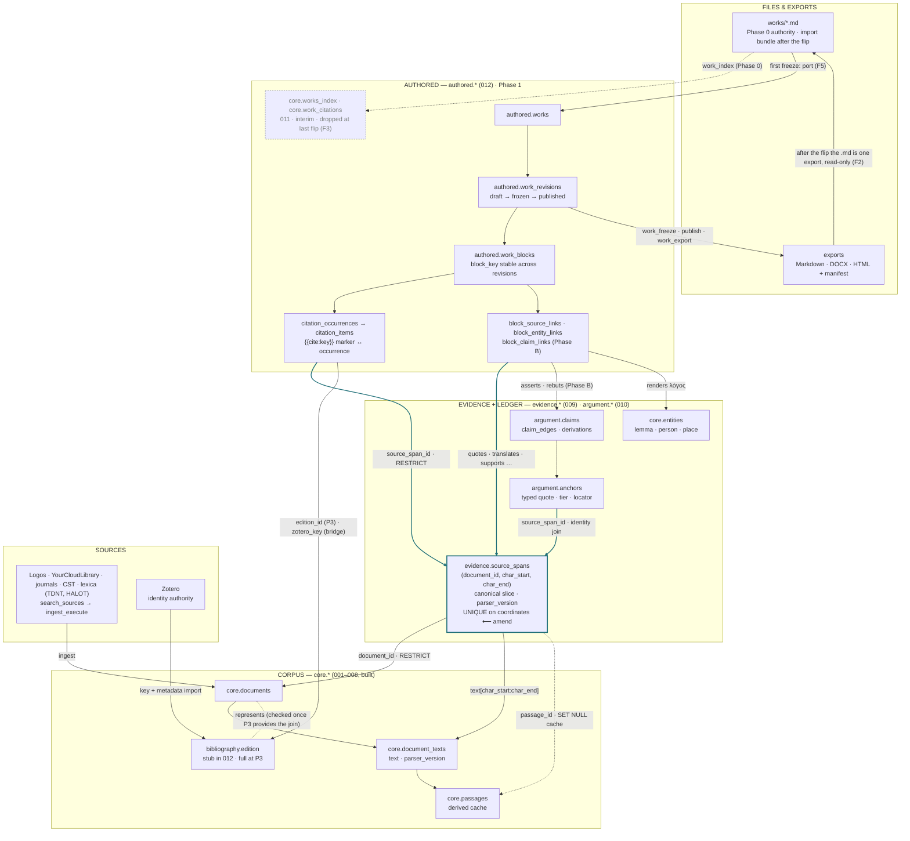
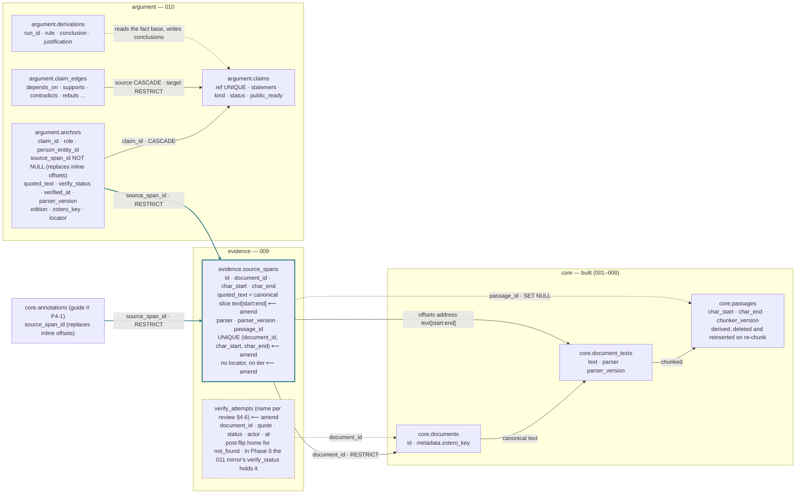
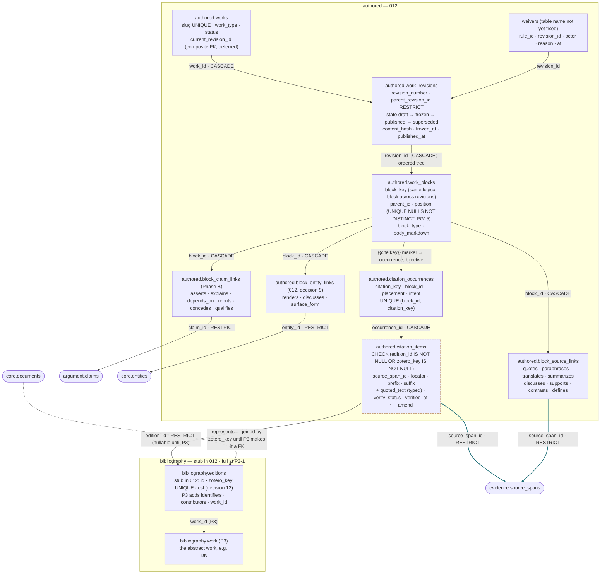
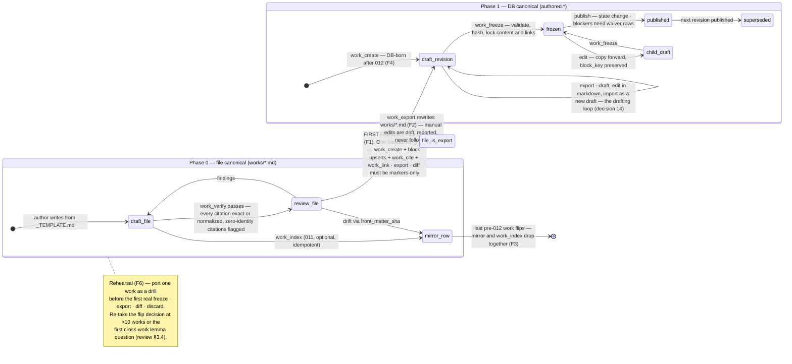
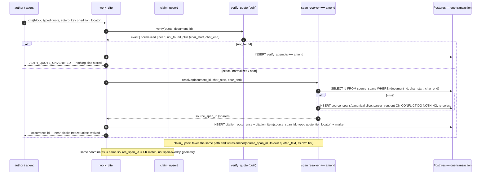
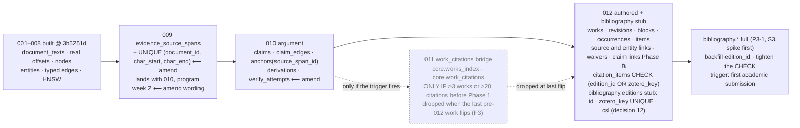
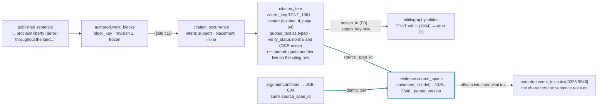
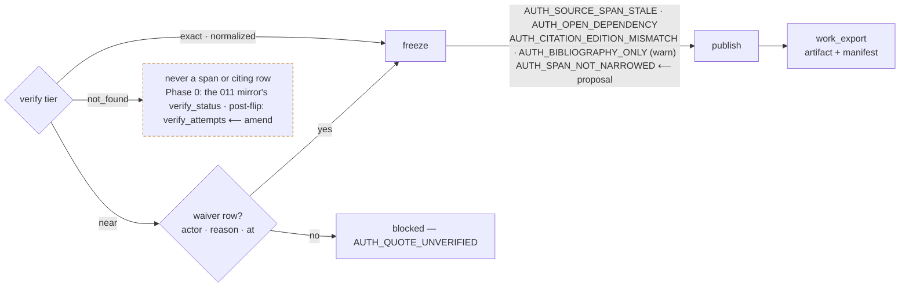
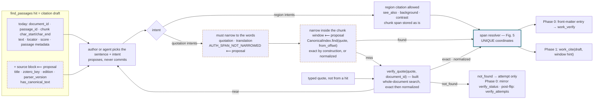
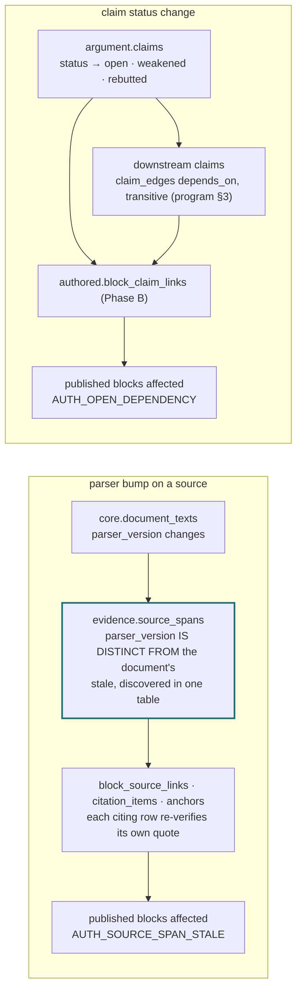

# Works and citations — architecture diagrams

**Status:** Diagram set. Written 2026-09-04 against `works-architecture-master.md`
as amended by `works-architecture-master-review.md` §4. The amendments are
**pending ratification**; every figure marks them `⟵ amend` so the master's
shape and the review's proposal are both visible.
**Baseline:** engine `main` @ `3b5251d` — migrations 001–008 built; 009–012 and
P3 designed only. Phase-0 tools (`work_*`) do not exist yet.
**Decisions:** fourteen taken by the researcher on 2026-09-04; see "Decisions taken"
below. Applied to the master the same day (master §13 change log).
**Purpose:** the picture an implementation doc will be written against. Each
figure shows one mechanism the prose argues for, and its caption names the
sections it draws from. Where a figure and the master disagree, the master
wins; where a figure shows an amendment, review §4 is the proposal text.

## How to read the figures

| Mark | Meaning |
|---|---|
| plain node | in the master (ratified design) |
| `⟵ amend`, amber dashed border | from review §4; ratified and applied to the master 2026-09-04 |
| `⟵ proposal`, amber dashed border | proposed by this diagram set; ratified 2026-09-04 (decision 6), tunable per work type |
| grey dashed | interim — Phase 0 mirror (011), dropped when the last pre-012 work flips |
| thick teal border | `evidence.source_spans`, the one copy of anchoring; teal edges are its identity joins |
| `RESTRICT` / `SET NULL` / `CASCADE` on an edge | the FK's delete rule — these are the load-bearing promises |
| `(Phase B)`, `(P3)` | lands on that trigger, not with 012 |

Span tier ownership is **Option B**, ratified 2026-09-04 (decision 1): the span
owns coordinates and the canonical slice; each citing row owns its typed quote
and tier. Option A was rejected.

---

## Fig. 1 — The layered picture

One evidence primitive under three consumers; works above it; files at the top
as Phase-0 authority and, after the flip, as one export among several.

*Draws from:* master §0, §3, §4, §6; program doc §10 (the layered picture, now
with an authored layer inside the engine); review §4.2 F2/F3/F5.

---

## Fig. 2 — The span hub: corpus, evidence, ledger

What `evidence.source_spans` owns, what each consumer keeps for itself, and
where a failed verification goes (never into the span table).

*Draws from:* master §2, §4; target §7; program doc §2, §10 (derivations); review
§3.1, §4.1 (Option B), §4.6 item 4. `not_found` never becomes a span. In Phase 0
the 011 mirror records it honestly (bridge §4, `verify_status NOT NULL`); after the
flip only the attempts log does. **Option A** would put `quoted_text` (typed)
and `verify_status` on the span and strip them from `anchors`; everything else
in this figure stands either way.

---

## Fig. 3 — The authored layer and its typed links

Works → revisions → blocks, with three *different* relations hanging off a
block: citation occurrence (where it is cited), source link (what the block does
with the span), claim / entity link (what the block expresses).

*Draws from:* master §5, §6; target §6, §8, §9, §13 (waivers as rows); review
§4.1 item 4 (`citation_items` gains tier columns). The typed `quoted_text` on
`citation_items` is not named by the review but follows from its item 5, which
recomputes each citing row's tier "from its own quoted_text". The `current_revision_id`
composite FK and the `NULLS NOT DISTINCT` constraint are target §6 details the
implementation doc must carry (PG15 is confirmed: the dev server is
`pgvector/pgvector:pg15`).

---

## Fig. 4 — Authority over a work's lifetime: the flip as a protocol

Files are canonical until a work's first freeze. The review turns that moment
into six clauses (F1–F6); this is the state machine they describe.

*Draws from:* master §3, §8; review §3.2, §3.4, §4.2 (F1–F6), §4.5 (`work_freeze`
moved into the Phase-1 spine because its trigger *is* the flip trigger); decision
14 (the drafting loop is the bundle import of target §15.2, made routine).

---

## Fig. 5 — The write path: one resolver, two writers, one span

Why "identity join" is true only with the review's resolver: `work_cite` and
`claim_upsert` over the same characters must land on the same row.

*Draws from:* master §4, §8 (`work_cite` is the atomic write boundary, target
§11.2); program doc §4 item 1 (`claim_upsert` calls `verify_quote` and refuses
`not_found`); review §3.1, §4.1 (resolver protocol, Option B), §4.6 item 4.

---

## Fig. 6 — Migration sequence and triggers

*Draws from:* master §9; review §1.3 (PG15 confirmed), §4.6 item 5. All
additive; each revertible independently.

---

## Fig. 7 — Descent: from a published sentence to characters

The invariant both companions share, drawn on the worked example (Lev 25 /
*deror*, bridge §7). Coordinates are the example's, not real rows.

*Draws from:* master §0, §12 items 3–4; bridge §7; program doc §10.

---

## Fig. 8 — Gates: tiers and waivers

Where a citation can be stopped, and by which rule ID.

*Draws from:* master §2, §7; target §8.3, §13; review §4.6 item 1 (`near` blocks freeze unless waived; `not_found` never enters).

---

## Fig. 9 — From retrieval to citation: the hit is a draft

A search hit is a citation draft, not a citation and not merely a place to
look. Its chunk offsets are a valid address into canonical text that survives
re-chunking; what they are not is the words the sentence rests on. Search
stays a pure read: a citation is a durable write with foreign keys and
permission gating, and a read that wrote rows would spray duplicates every
time an agent retried. The hit should instead carry everything the write needs
as input, verbatim, and the write should narrow the draft inside the hit's own
window before falling back to a whole-document search.

Three engine facts shape this (checked 2026-09-04): hits carry passage
metadata, not document metadata, so bibliographic identity is missing from
them today; older chunkers collapsed whitespace when building passages, so a
quote copied from hit text may only match `normalized` and narrowing by string
arithmetic is unsafe; and `CanonicalIndex.find` already accepts a from-offset
hint that `verify_quote` does not use, so a scoped verify still scans the
document from the start.

Intent decides granularity, enforced at the write and at validation rather
than at search: `quotation` and `translation` must narrow to the exact words
(error); `see_also`, `background` and `contrast` may cite the region; `support`,
`source` and `definition` should warn when the stored span is a whole chunk.
These are core defaults: a work-type policy may move any intent between error,
warn and allow (target §13), and packs may add stricter validators (decision 6).
In Phase 0 the intent is the front-matter `intent` field (decision 11), and a
`zotero_key` that no ingested document carries is a `work_verify` finding
(decision 12).

| Field of the draft | Filled by | Notes |
|---|---|---|
| `document_id` | hit | the durable half of the address |
| window: chunk `char_start`, `char_end` | hit | provenance and narrowing hint; a valid address that survives re-chunking, but coarse |
| `quote` | author or agent | the sentence as it will appear in the work |
| `intent` (and optional `role`) | author or agent | required in front matter (decision 11); decides whether narrowing is required |
| `locator` | hit, editable | the pin-cite attached by `set_locators` |
| identity: `zotero_key`, `edition` | hit `source` block ⟵ proposal | from `documents.metadata` now, `bibliography.editions` after 012; absent today, so agents drop it; an unknown key is a `work_verify` finding (decision 12) |
| `parser_version` | hit `source` block ⟵ proposal | recorded on the span; staleness is checkable from the first citation |
| `has_canonical_text` | hit `source` block ⟵ proposal | false means bibliography-only at best; the agent should know before drafting on it |
| resolved span + tier | narrowing or `verify_quote` | written by the resolver; the tier lives on the citing row |

*Draws from:* engine `services/search/hybrid.py`, `services/text/anchoring.py`,
`services/verification/quote.py`; program doc §2 (the anchoring rule), §8;
bridge §9 (agents propose, authors commit); master §8; target §8.2 (intents),
§13 (rule ids). The `source` block, the window-hint narrowing path and the
intent-granularity rule are **proposals of this diagram set**; the muse
diagram's §4.2 was the starting point, with `search_sources` corrected to
`find_passages` and "never stored" replaced by "a draft the write narrows".

---

## Fig. 10 — Impact queries

The two questions the flip exists to answer cheaply: what does a parser bump
stale, and what does a claim's change of status undermine. Both are target §10
queries and the Phase B acceptance test.

*Draws from:* target §10 (both queries), §18 Phase B acceptance; program doc §3
(leverage query), §11 (propagation); master §4 ("reverify discovers in one
table", per review §4.1 item 5).

---

## Tool surface, by layer

One row per layer: what runs, what it touches, and what pulls it into
existence. Amended tools carry `⟵ amend`.

| Layer | Tools | Tables | Trigger |
|---|---|---|---|
| Substrate | `verify_quote` (built; tier-honesty tests missing, review §4.3), `find_passages` (hits gain a `source` block ⟵ proposal), `get_passage_context` | `document_texts`, `passages`, span index | built |
| Phase 0 (no migration) | `work_verify`, `work_index`, `work_citations`, `work_render` | `works/*.md` only | one real work hand-verified first (review §4.3) |
| 009 | span resolver, shared by `work_cite` and `claim_upsert` | `evidence.source_spans` + UNIQUE coordinates ⟵ amend | lands with 010, program week 2, after review §5 items 1–3 are applied as doc edits |
| 010 | `claim_upsert`, `argument_graph`, `claim_leverage`, `claim_reverify` | `argument.claims`, `claim_edges`, `anchors(source_span_id)`, `derivations`; `verify_attempts` ⟵ amend | program week 2 |
| 011 (conditional) | the same Phase 0 tools | `core.works_index`, `core.work_citations` | only if >3 works or >20 citations before Phase 1; dropped at last flip (F3) |
| 012 | spine: `work_create`, `work_block_upsert`, `work_cite`, `work_link`, `work_validate`, `work_trace`, `work_get` ⟵ amend, `work_freeze` ⟵ amend; `work_cite` takes the hit's window as a narrowing hint ⟵ proposal; drafting loop `work export --draft` / `work import` (decision 14) | `authored.*` + `bibliography.editions` stub (decision 12) | first freeze pending; rehearsal (F6) first |
| P3-1 | Tier-1 inline display; `edition_id` backfill | `bibliography.*` full | first academic submission |
| Deferred | `work_export` with manifest (first publication), project membership (first reuse), lemma checks (first cross-work translation query), block FTS / embeddings (first measured need), CSL (P3-3) | — | named triggers only |

Phase 0 tools and their Phase 1 successors return the same rule ids, so nothing
downstream depends on which phase produced a verdict:

| Phase 0 | Job | Superseded by |
|---|---|---|
| `work_verify [path]` | run `verify_quote` per front-matter citation; rule ids; unresolved claim refs are findings; zero-identity citations are findings from day one (review §4.6 item 3) | `work_validate` |
| `work_index` | rebuild the 011 mirror; drift via `front_matter_sha`; lives while any pre-012 work is unflipped (F3) | dropped with the mirror |
| `work_citations --document/--zotero/--claim` | which works cite this source / entry / claim | `work_trace` |
| `work_render [path]` | footnotes from rows; the only free-text boundary | `work_export` |

---

## Suggested build order

Written out step by step, with gates, tests and done criteria, in
`works-implementation-guide.md`. Derived from review §4.3, §5 and §8, bridge §8, and program doc §7. The muse
diagram's order put the 009 span table before the first real work; that
inverts the review's own discipline and is corrected here.

1. Tier-honesty tests for `verify_quote`. Add `intent` to the file contract
   (decision 11, done). One real work (Lev 25 / *deror*) hand-verified through
   the existing CLI. Commit the doc set. No code beyond the tests.
2. Phase 0 tools against files. No migration.
3. Apply review §5 items 1–2 as doc edits (span identity, flip protocol).
   Only then 009 + 010 together on the ledger track, resolver included.
4. 011 only if its trigger fires.
5. Flip rehearsal (F6): port one work, export, diff, discard.
6. 012 spine including `work_freeze`, `work_get`, the editions stub, and the
   export/import drafting loop; the first real freeze.
7. `bibliography.*` full at the first academic submission.

First tests (review §6): tier honesty; identity-join idempotency; port-drill
markers-only diff; flip-drift detection; mirror idempotency; RESTRICT; publish
gate.

---

## Decisions taken 2026-09-04

Taken by the researcher against the options in this set and applied to the
master in its 2026-09-04 edit pass (master §13).

| # | Decision | Taken | Consequence in the figures |
|---|---|---|---|
| 1 | Span tier ownership | **Option B** | the span owns coordinates, canonical slice, `parser_version`; each citing row owns typed quote, tier, timestamp, locator; `citation_items` gains `quoted_text`, `verify_status`, `verified_at` (Figs. 2, 3, 5, 7) |
| 2 | The flip | **Adopt F1–F6**, including the rehearsal and the re-take trigger | Fig. 4 as drawn; `work_index` and the mirror drop together; post-012 works are DB-born |
| 3 | Rights | **Removed from scope.** Everything in the corpus is the researcher's private library. No classification, no export gate. Not to be raised again | rights removed from Figs. 1, 2, 6, 8 and the tool table |
| 4 | Failed attempts | **`verify_attempts` table**, built at first need; the gap is stated until then | Figs. 2, 5, 8, 9 |
| 5 | Spine | **Both ship**: `work_freeze`, `work_get` | tool table |
| 6 | Citation draft | **Adopt** the `source` block, the window-hint narrowing path, and the intent-granularity defaults. **Defaults are tunable**: a work-type policy (target §13) may move any intent between error, warn and allow, and packs may add stricter validators | Figs. 8, 9 |
| 7 | Works root | **A configured works directory outside the engine repo**; `work_path` is relative to it | Fig. 4; `works_index.work_path` |
| 8 | Spine, final | **All eight ship with 012**: `work_create`, `work_block_upsert`, `work_cite`, `work_link`, `work_validate`, `work_trace`, `work_get`, `work_freeze`. `work_export` deferred to first publication | tool table |
| 9 | Entity links | **`block_entity_links` ships with 012** so the lemma query, the flip's justification, exists at the flip. Claim links stay Phase B | Figs. 1, 3, 6 |
| 10 | 009 wording | **Lands with 010, after Phase 0**; never built alone | Fig. 6 |
| 11 | Citation vocabulary | **`intent` is required in the file contract** (quotation · translation · support · contrast · background · definition · source · see_also); `role` is optional, only when the citation also backs a claim ref. Unknown intent is a `work_verify` finding. Default mapping for role-only entries: supports→support, rebuts→contrast, context→background, asserts→quotation when the quoted text appears verbatim in the prose, else source | Fig. 9; `works/README.md`, `works/_TEMPLATE.md` |
| 12 | Editions | **Minimal stub in 012**: `bibliography.editions` (id, `zotero_key` UNIQUE, `csl` jsonb), populated at ingest from each document's `metadata.zotero_key`; documents join by key until P3 makes it a FK; a key no ingested document carries is a `work_verify` finding | Figs. 3, 6; tool table |
| 13 | Residue | **All four edits in the master pass**: bridge numbering note in §10; README opening sentence (done here); the fifth grade `no_canonical_text` is never stored; close §11.1 with decision 7 | edit pass |
| 14 | Drafting after the flip | **Export-edit-import is the named drafting loop**: `work export --draft` writes markdown, `work import` reads it back as a new draft revision with a dry-run diff; markers survive the round trip; no sync. Tested by the rehearsal (F6). No hurry to flip: the file phase may carry the whole program and the re-take trigger stands | Fig. 4; tool table |

---

## Amendment index — what the review changes, by figure

All rows were ratified on 2026-09-04 except §4.4, which is removed from scope.

| Review | Change | Figures |
|---|---|---|
| §4.1 | Span identity: `UNIQUE (document_id, char_start, char_end)`; lookup-before-insert resolver; `locator` and tier off the span (Option B); `citation_items` gains tier columns | 1, 2, 3, 5, 7 |
| §4.2 | Flip protocol F1–F6 + rehearsal; `work_index` and mirror are one unit; post-012 works are DB-born | 1, 4, 6 |
| §4.4 | `core.documents.rights_class` and the export gate. **Removed from scope** by decision 3 | — |
| §4.3 | Phase-0 reality checklist (one real work, `verify_quote` tests, commit the docs) | tool surface, build order |
| §4.5 | `work_freeze` into the spine; `work_get` restored | 4, tool surface |
| §4.6 | `near` waivable, `not_found` never enters spans or citing rows; `verify_attempts` log; zero-identity findings; 009 "lands with 010"; numbering residue | 2, 5, 6, 8 |
| §3.8 | Commit the doc set; name the `work_path` resolution config | open decisions |

Added by this diagram set, beyond the review:

| Source | Change | Figures |
|---|---|---|
| review §4.1 item 5, implied | typed `quoted_text` on `citation_items`, alongside the tier columns | 3, 5, 7 |
| bridge §4, restated | `not_found` is stored by the Phase 0 mirror's `verify_status`; only spans and Phase 1 citing rows exclude it | 2, 8, 9 |
| proposal | a hit is a citation draft: `find_passages` hits gain a `source` block (title, `zotero_key`, `edition`, `parser_version`, `has_canonical_text`) | 9 |
| proposal | the write narrows the quote inside the hit's window before any whole-document `verify_quote`; intent decides granularity, `AUTH_SPAN_NOT_NARROWED` | 8, 9 |
| decision 11 | `intent` required in the file contract; `role` optional | 9, file contract |
| decision 12 | `bibliography.editions` stub in 012, keyed on `zotero_key` | 3, 6 |
| decision 14 | export-edit-import as the Phase 1 drafting loop | 4, tool table |

## Provenance: the muse diagram

`works-architecture-master-review_muse.md` was compared against this set on
2026-09-04. **Adopted:** `quoted_text` on `citation_items` (its §2); the
retrieval-to-citation contract (its §4.2, retooled onto `find_passages`,
Fig. 9); the impact queries (its §5, Fig. 10); the joined layer / tools /
tables / trigger table (its §6); a build order (its §8, re-sequenced).
**Not adopted:** `SPAN --> MIR` in its §1 (the 011 mirror anchors inline,
bridge §4; the master revises anchors and annotations to `source_span_id`,
never the mirror); `search_sources` as the retrieval tool (it is external
source discovery feeding `ingest_execute`); "`not_found` never enters any
table" (the Phase 0 mirror stores it by design). **Refined after inspecting the
engine** (same day): its "provisional, never stored" hit became the citation
draft of Fig. 9, because chunk offsets are a valid address and the real gaps
are missing identity on the hit and a narrowing path that ignores the hint.

## Open decisions remaining

1. **Locator vocabularies** — which keys a verse, a lexicon entry, or a page
   range uses (master §11.3). Answered by the first real work; the figures use
   the example's `{volume, page}` and `{verses}` shapes only.
2. **Work-type policy values** for intent granularity (decision 6) — set by the
   first real work in each type, starting from the Fig. 9 defaults.
