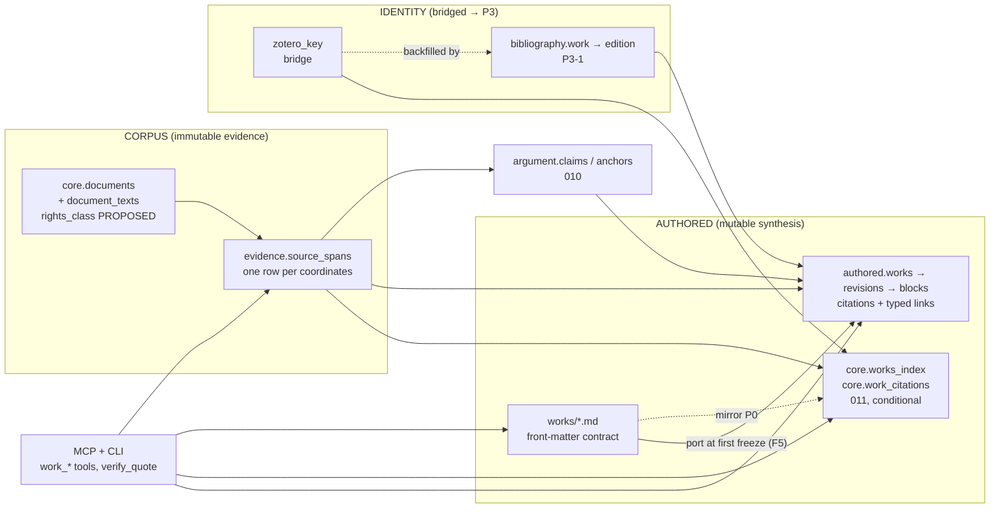
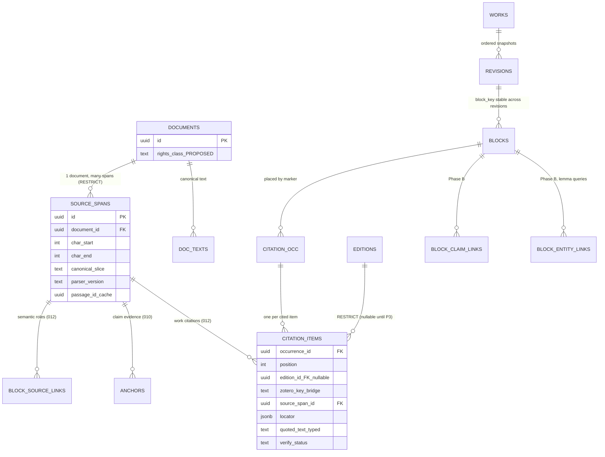
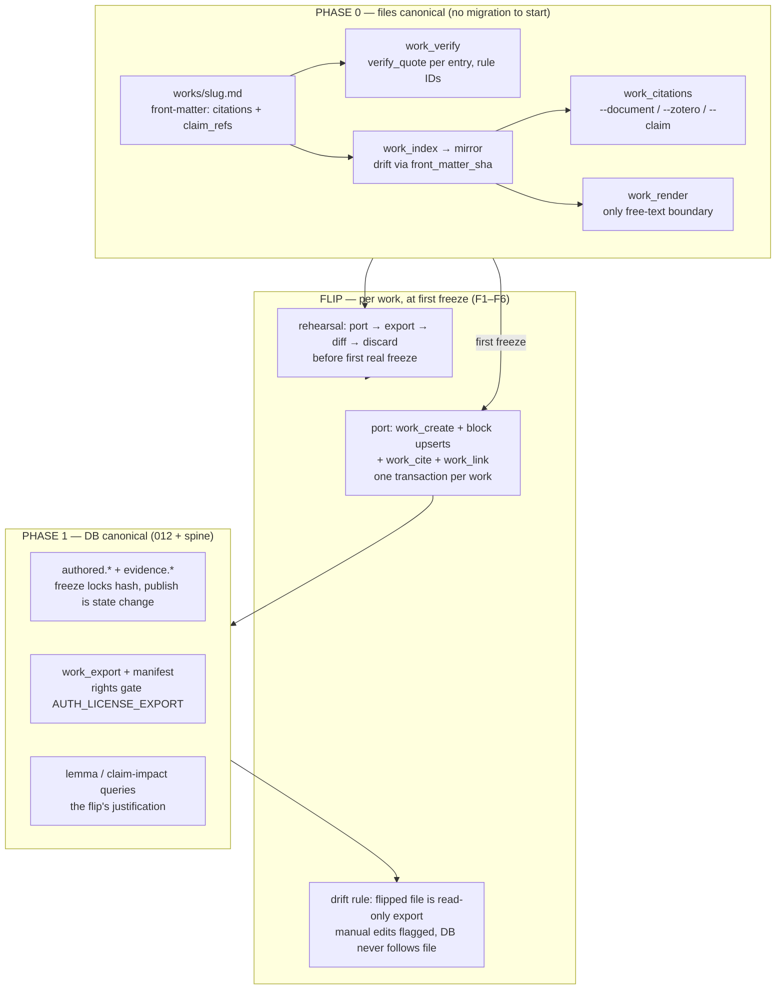
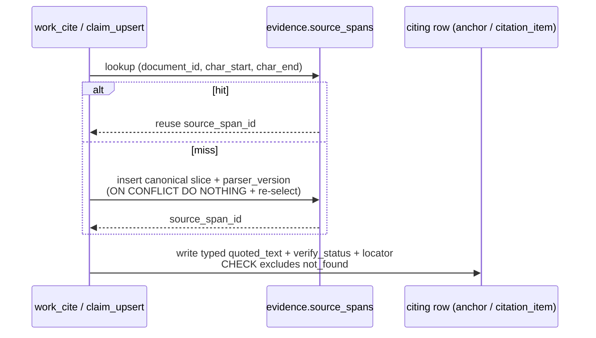
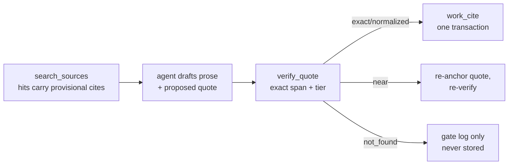
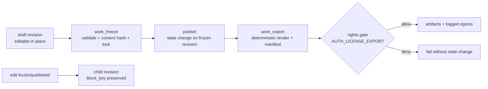

# Works + citations — architecture diagram

**Status:** Diagram. Derived from `docs/design/works-architecture-master-review.md`
(the review), which audits `works-architecture-master.md` (the controlling doc),
`authored-works-architecture.md` (target), and `work-citations-architecture.md`
(bridge). This file draws the system; it does not amend the master.
**Scope:** the works/citations feature set only (migrations 009–012 + Phase-0/Phase-1 tools).
**Baseline (per the review, engine @ `3b5251d`):** migrations 001–008, `verify_quote`,
`document_texts`, span index built; 009+, P3, all `work_*` tools, all
`evidence`/`authored` tables not built; `works/` holds README + `_TEMPLATE.md` only.
**Review amendments drawn here:** §4.1 (span identity, **Option B**), §4.2 (flip
protocol F1–F6), §4.4 (rights via join), §4.5 (spine fixes). Anything the review
marks "master must ratify" is labeled **PROPOSED** below, not fact.

Conventions: solid arrow = FK / data flow; dashed = derived or provisional;
`[P0]` = Phase 0 (files canonical); `[P1]` = Phase 1 (DB canonical).
`Option B` = review-recommended shape (span owns coordinates + canonical slice;
citing rows own typed quote + tier). It is drawn as the architecture because the
review recommends it, but it is **PROPOSED until the master ratifies it**.

---

## 1. System context

Reading: the corpus never points at authored objects. Everything authored
(files, mirror, `authored.*`, ledger anchors) points **inward** to spans and
documents. Bibliographic identity starts as `zotero_key` strings and hardens
into `bibliography.*` FKs without rewriting work files.

---

## 2. Data architecture (target shape, with review amendments)

Notes a principal will check:

- `SOURCE_SPANS` uniqueness is the whole diagram's load-bearing constraint:
  `UNIQUE (document_id, char_start, char_end)` — **PROPOSED (§4.1)**. Without it
  the "identity join" below is span-overlap geometry with a nicer name.
- `locator` lives on **citing rows** (anchors, citation items), never on the
  span — **PROPOSED (§4.1)**. Two citers of one span routinely cite different
  pages/verses; first-writer-wins on the span would be arbitrary.
- `verify_status` (`exact` / `normalized` / `near`, never `not_found`) lives on
  **citing rows** under Option B; the span carries the canonical slice and
  `parser_version` for stale discovery. `not_found` never enters any table;
  failed attempts are recorded only by the gate/mirror layer (bridge honesty
  rule), with a `verify_attempts` log post-flip still an open question (§4.6.4).
- `ON DELETE RESTRICT` from every citing row into documents/spans/editions;
  `passage_id` is a `SET NULL` re-chunk cache, never an address.
- `CITATION_ITEMS` CHECK is `edition_id IS NOT NULL OR zotero_key IS NOT NULL`
  (master §5: the P3-dependency removal). `zotero_key`-only rows are portable
  today, backfilled at P3.
- Rights: classification column on `core.documents` (**PROPOSED §4.4**); the span
  carries no rights copy — export consults `span → document → rights` at egress
  time so reclassification cannot go stale.

---

## 3. Authority staging: Phase 0 vs Phase 1

- Mirror (`011`) and `work_index` are **one unit**: they live while any pre-012
  work is unflipped, drop together when the last one flips (F3). "Dropped at
  flip" is per-fleet, not per-work — **PROPOSED clarification (§4.2)**.
- Post-012 works are **DB-born** (`work_create`); file-first survives only as
  explicit bundle **import** (F4, target §15.2) — **PROPOSED (§4.2)**.
- Port acceptance (F5): `work_export` regenerates the file; the only acceptable
  diff is citation markers (`[^cN]` → `{{cite:<uuid>}}`); anything else is a port
  bug; the marker mapping is logged.
- Interim-forever guard (review §3.4): the flip rehearsal keeps the port warm;
  re-take the flip decision explicitly at >10 works or the first cross-work
  lemma question so deferral is a recurring decision, not a default state.

---

## 4. Write paths

### 4.1 Shared span resolver (the identity join, §4.1 Option B — PROPOSED)

Second cite of identical coordinates creates a citing row and **no new span**.
Re-verify discovers staleness in one table (`parser_version` mismatch vs
`document_texts`) and recomputes each citing row's tier from its own typed
quote. Alternative **Option A** (tier on the span, strongest-tier-wins) is
rejected by the review because it erases per-citation tier nuance; the master
must still ratify the choice.

### 4.2 Retrieval-to-citation pipeline (provisional → exact) — PROPOSED

Vector search operates over chunks, not character spans, so citation is a
two-stage pipeline integrated into the MCP flow — not a step the author does
afterwards:

- **Stage 1 — provisional.** Each search hit returns `document_id` +
  `passage_id` + score, labeled **provisional**. Good enough to show the
  researcher ("the answer came from roughly here"), never stored: passages are
  a re-chunkable cache (`SET NULL`), not an address.
- **Stage 2 — exact.** The proposed quote goes through `verify_quote` against
  `document_texts`, yielding `(char_start, char_end)` + tier. That result is
  what §4.1's resolver stores. `near` routes back for re-anchoring;
  `not_found` is recorded by the gate/mirror layer as an attempt, never as a row.
- **Commit discipline is unchanged:** the agent proposes, the human (or the
  freeze gate) commits; unverified citations cannot reach `published`.

Contract addition for the implementation doc: the provisional citation shape on
the search response (`document_id`, `passage_id`, score, `provisional: true`)
and the requirement that every stored citation arrive via verify-then-write.

### 4.3 Citation write boundary

`work_cite` resolves identity → verifies the quote → writes span + occurrence +
item + marker **in one transaction** (target §11.2). A failed verification
aborts the citation; nothing half-written survives. Claim refs in Phase 0 are
inert text (`claims: [JUB-004]`), grep-able now, FK-joined after 010.

### 4.4 Freeze / publish / export

`work_freeze` belongs to the Phase-1 spine (trigger = first freeze, same as the
flip) — **PROPOSED move (§4.5)**. `work_export` stays deferred to first
publication. Frozen revisions reject every mutation path; edits copy forward.
Waivers are rows (rule ID + revision + actor + reason + timestamp), never flags.

### 4.5 Validation flow (stable rule IDs, waivable warnings)

`work_verify` (P0) / `work_validate` (P1) return the same rule IDs so nothing
downstream depends on phase: `AUTH_QUOTE_UNVERIFIED`, `AUTH_SOURCE_SPAN_STALE`,
`AUTH_CITATION_EDITION_MISMATCH`, `AUTH_OPEN_DEPENDENCY`,
`AUTH_LICENSE_EXPORT`, `AUTH_BIBLIOGRAPHY_ONLY`, … Precise tier rule
(**PROPOSED wording §4.6.1**): `not_found` never enters tables;
`near` blocks freeze **unless waived**. Zero-identity citations (no
`zotero_key`, no edition) are `work_verify` findings from day one, because the
§5 CHECK will refuse them at port time.

---

## 5. What the joins buy (trace queries)

- Block → citation → edition → characters: "every block rendering λόγος, across
  works and revisions" (`block_entity_links` + blocks + revisions).
- Claim ↔ work: shared `source_span_id` makes "this essay renders the evidence
  of that claim" an equality join, not overlap geometry (requires §4.1).
- Blast radius: parser bump → stale spans in one table → every dependent
  published block; claim status change → every block with a `block_claim_link`.
- Leverage query from day one: "which works cite this source" via the mirror;
  same question via `work_trace` after the flip.

---

## 6. Tool ↔ migration map

| Layer | Tools | Tables | Trigger |
|---|---|---|---|
| Substrate | `verify_quote` (+ tier-honesty tests — missing, §4.3) | `document_texts`, corpus index | built |
| 009 | `claim_upsert` (via program) | `evidence.source_spans` + resolver | now; lands with 010 (week 2) |
| 010 | claim ledger | `argument.*`, anchors revised to `source_span_id` | program week 2 |
| P0 (no migration) | `work_verify`, `work_index`, `work_citations`, `work_render` | files only | one real work first (§4.3) |
| 011 (conditional) | same P0 tools | `core.works_index`, `core.work_citations` | only if >3 works / >20 citations before P1 |
| 012 | spine: `work_create`, `work_block_upsert`, `work_cite`, `work_validate`, `work_trace`, `work_freeze` (+ `work_get` restored or `work_trace` as read path — §4.5) | `authored.*` + `bibliography` stub | first freeze pending |
| Deferred | `work_export` (first publication), project membership, lemma checks, block FTS/embeddings | — | named triggers only |

`rights_class` migration rides whichever migration is nearest when the first
export gate fires (§4.4). All migrations additive, independently revertible.

---

## 7. Deltas this diagram assumes (master-ratification checklist)

| # | Amendment (review ref) | Shape drawn here | Status |
|---|---|---|---|
| 1 | Span identity + locator placement (§4.1, Option B) | §2, §4.1 | PROPOSED — master must pick A/B |
| 2 | Flip protocol F1–F6 + rehearsal (§4.2) | §3, §4.4 | PROPOSED — doc edit + drill |
| 3 | Rights column on `core.documents`, join not copy (§4.4) | §2, §4.4 | PROPOSED — doc edit + additive migration |
| 4 | One real work + `verify_quote` tier tests before ratification (§4.3) | §6 | process gate, not drawn |
| 5 | `work_freeze` to spine; `work_get` restored (§4.5) | §4.4, §6 | PROPOSED |
| 6 | Wording/CHECK fixes: near-vs-waiver, hash-drop note, zero-identity findings, attempts log, 009 wording, numbering (§4.6) | §2, §4.5 | PROPOSED |
| 7 | Commit doc set; name `work_path` resolution config (§3.8) | out of diagram scope | process |
| 8 | Retrieval-to-citation pipeline, provisional cite on search response (§4.2) | §4.2 | PROPOSED — new in this diagram, needs master ratification |

Open questions carried forward (review §7): span-tier ownership (item 1 above),
post-flip failed-attempt recording (`verify_attempts` table vs accepted gap),
`work_path` resolution while works and engine live in different checkouts.

---

## 8. For the implementation doc (not this session)

Suggested build order falls out of the diagram: tier-honesty tests for
`verify_quote` → 009 span table + resolver → one hand-verified real work (Lev 25
/ *deror*) → P0 tools → conditional 011 → rehearsal drill → 012 spine. Do not
build 009/010 until checklist rows 1–3 are ratified doc edits (review §8
standing verdict). First-test list: tier honesty, identity-join idempotency,
port-drill markers-only diff, flip-drift detection, mirror idempotency,
RESTRICT, publish gate (review §6).
