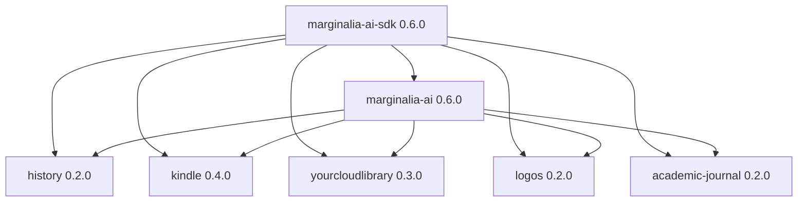

# PyPI/plugin migration execution index

**Purpose:** Ordered runbook for implementing the approved
[PyPI/plugin architecture](../../design/pypi-plugin-distribution-architecture.md) across all
five repositories.

## Fixed decisions

Do not reopen these choices inside an implementation ticket:

| Concern | Decision |
|---|---|
| Core distribution | `marginalia-ai` |
| SDK distribution | `marginalia-ai-sdk` |
| Plugin distributions | `marginalia-ai-plugin-{history,logos,academic-journal,kindle,yourcloudlibrary}` |
| Plugin discovery | `importlib.metadata` entry points in `research_engine.plugins` |
| Manifest | Static `<import_package>/plugin.yaml`, schema v2 |
| Installation | pip/uv/pipx; core never invokes package managers or Git |
| Activation | Explicit `research-engine plugin enable`; no auto-enable |
| Upgrade | Version or manifest-hash change requires `approve-upgrade` |
| Loading | Stage and validate the whole plugin, then commit atomically |
| SDK direction | plugin → SDK ← core; published plugins never import `research_engine.*` |
| Legacy loader | Removed in the cutover; legacy files preserved but never executed |
| Base core | No Torch, CUDA, sentence-transformers, or Docling |
| Core/SDK release | `0.6.0`, lockstep through `0.x` |

## Repository guides

Run these in order:

1. [Core, SDK, and history](core-sdk-history.md) — repository `John-Cusack/MarginaliaAI`.
2. [Kindle](kindle.md) — repository `John-Cusack/marginalia-plugin-kindle`.
3. [YourCloudLibrary](yourcloudlibrary.md) — repository `John-Cusack/marginalia-plugin-yourcloudlibrary`.
4. [Logos](logos.md) — repository `John-Cusack/marginalia-plugin-logos`.
5. [Academic journal](academic-journal.md) — repository
   `John-Cusack/marginalia-plugin-academic-journal`.

Kindle and YourCloudLibrary may run in parallel after core/SDK `0.6.0` is available. Logos
waits for the final SDK chunking/ingestion contract. Academic-journal begins with source
recovery before packaging changes.

## Release dependency graph



Plugin distributions depend on SDK in package metadata. Core compatibility is declared in
`plugin.yaml` and proven by integration tests; plugin wheels do not depend on core at install
time.

## Execution rules

- Run each guide from that repository's root.
- Preserve uncommitted work. YCL and academic-journal currently have substantial uncommitted
  changes; do not reset, clean, overwrite, or reconstruct them from the public remote.
- Commit/review existing feature work before mixing it with packaging changes, or carry it
  forward deliberately in the same branch with a clearly separated diff.
- Never build release artifacts from `~/.research-engine/plugins`; those are deployed copies,
  not release sources.
- Build and test wheels/sdists from reviewed repository commits only.
- Do not publish a version until production artifacts—not editable checkouts—pass smoke tests.
- Do not add compatibility aliases for `research_engine.plugins.sdk`, root `pack.yaml`, or the
  Git-copy loader. Migrate every caller and remove the obsolete path.
- PyPI versions are immutable. A failed upload or bad release is fixed with a higher version.

## Cross-repository contract handoff

The core guide must produce and publish:

```text
marginalia-ai-sdk==0.6.0
marginalia-ai==0.6.0
marginalia-ai-plugin-history==0.2.0
```

It must also publish the SDK contract documentation for:

- manifest schema v2;
- entry-point/resource discovery;
- `PluginContext`;
- `IngestionClient.ingest_document()`;
- event/source-search DTOs;
- custom chunking DTOs/helpers;
- decorators and public errors;
- plugin contract-test helpers.

External plugin work does not begin against a guessed SDK. If core implementation changes one
of these contracts, update the architecture and all affected implementation guides before
publishing SDK `0.6.0`.

## Common plugin artifact gate

Every plugin repository must satisfy this exact sequence:

```bash
rm -rf dist
uv build
uvx --from twine twine check --strict dist/*
```

Then, in a clean environment outside the checkout:

```bash
python -m venv /tmp/re-plugin-smoke
/tmp/re-plugin-smoke/bin/python -m pip install --upgrade pip
/tmp/re-plugin-smoke/bin/python -m pip install marginalia-ai==0.6.0
/tmp/re-plugin-smoke/bin/python -m pip install dist/*.whl
/tmp/re-plugin-smoke/bin/research-engine plugin list
```

The repository-specific guide supplies its enable/migrate/tool smoke commands. Remove the
throwaway environment after recording the result.

Artifact inspection must prove:

- entry point group/name/value are correct;
- `plugin.yaml` is present under the import package;
- all referenced schemas/migrations/resources are present;
- metadata carries README, license file, URLs, Python range, dependencies, and version;
- tests, caches, `.env`, cookies, browser profiles, downloaded models, extracted text, and
  licensed source material are absent.

## Common release automation

Each repository gets `.github/workflows/release.yml` with:

1. protected version-tag trigger;
2. version/tag/changelog agreement check;
3. unprivileged build and artifact-test job;
4. uploaded wheel/sdist GitHub artifact;
5. separate publish job using a protected `pypi` environment;
6. `id-token: write` only on the publish job;
7. `pypa/gh-action-pypi-publish` pinned to a reviewed commit;
8. default PEP 740 attestations enabled;
9. no API token secret and no `skip-existing`.

Core's workflow uses separate artifact/publish jobs for SDK, core, and history. SDK publishes
before core; history publishes after both.

## Production release order

1. Publish SDK `0.6.0`.
2. Install SDK `0.6.0` from production PyPI and rerun its standalone import gate.
3. Publish core `0.6.0`.
4. Install core `0.6.0` from production PyPI and run database/plugin-discovery smoke.
5. Publish history `0.2.0`; prove install → discover → enable → load.
6. Publish Kindle `0.4.0` and YCL `0.3.0` after their independent gates.
7. Publish Logos `0.2.0` after custom chunker and ingestion integration gates.
8. Publish academic-journal `0.2.0` only after its authoritative source is committed.

## Final system smoke

Use a fresh virtual environment and a copy of a real database—not the only production corpus:

```bash
python -m venv /tmp/re-system-smoke
/tmp/re-system-smoke/bin/python -m pip install --upgrade pip
/tmp/re-system-smoke/bin/python -m pip install \
  marginalia-ai==0.6.0 \
  marginalia-ai-plugin-history==0.2.0 \
  marginalia-ai-plugin-logos==0.2.0 \
  marginalia-ai-plugin-academic-journal==0.2.0 \
  marginalia-ai-plugin-kindle==0.4.0 \
  marginalia-ai-plugin-yourcloudlibrary==0.3.0
```

Set `RE_DB_URL` to the disposable database, then:

```bash
/tmp/re-system-smoke/bin/research-engine db upgrade
/tmp/re-system-smoke/bin/research-engine plugin list
/tmp/re-system-smoke/bin/research-engine plugin enable history --yes
/tmp/re-system-smoke/bin/research-engine plugin enable logos --yes
/tmp/re-system-smoke/bin/research-engine plugin enable academic-journal --yes
/tmp/re-system-smoke/bin/research-engine plugin enable kindle --yes
/tmp/re-system-smoke/bin/research-engine plugin enable yourcloudlibrary --yes
/tmp/re-system-smoke/bin/research-engine plugin migrate logos --yes
/tmp/re-system-smoke/bin/research-engine plugin migrate academic-journal --yes
/tmp/re-system-smoke/bin/research-engine plugin doctor
```

Final assertions:

- every installed distribution is discovered from entry-point metadata;
- no legacy directory is executed;
- every enabled plugin loads all contributions atomically;
- no permission/version/hash is pending;
- no plugin imports `research_engine.*`;
- base core remains installable without Torch/CUDA/Docling;
- MCP starts with `research-engine serve` and no repository `cwd`;
- named plugin tools appear in the MCP catalogue;
- plugin state/data from the previous deployment remains available.

Stop the release if any assertion fails. Fix forward, rebuild all affected artifacts, and repeat
from the first affected gate.
